# Devoluciones · Secuencias

El modelo de datos y los 16 endpoints del motor de aprobación de devoluciones, cada uno con su diagrama de secuencia, su contrato y las reglas que lo gobiernan.

Sales registra la devolución y nosotros generamos el número de nota. Solo el Nivel 1 del primer intento de una nota original selecciona ítems, y solo una nota disociada en `EDITING` admite cambios de cantidad.

### Índice

**Modelo**

- [Modelo de datos · Diez tablas en cuatro capas](#diez-tablas-en-cuatro-capas) — 10 tablas · 4 capas
- [Integridad · Lo que declara la base](#lo-que-declara-la-base) — restricciones e índices

**Endpoints**

- [01 · Registro de la devolución](#registro-de-la-devolución) — POST /refunds
- [02 · Bandeja de devoluciones](#bandeja-de-devoluciones) — GET /refunds
- [03 · Detalle de la nota](#detalle-de-la-nota) — GET /refunds/:id
- [04 · Apertura del nivel activo](#apertura-del-nivel-activo) — POST /refunds/:id/levels/current/view
- [05 · Selección de ítems del Nivel 1](#selección-de-ítems-del-nivel-1) — POST /refunds/:id/levels/1/item-selection
- [06 · Aprobar el nivel vigente](#aprobar-el-nivel-vigente) — POST /refunds/:id/levels/current/approve
- [07 · Rechazar el nivel vigente](#rechazar-el-nivel-vigente) — POST /refunds/:id/levels/current/reject
- [08 · Reactivar una nota rechazada](#reactivar-una-nota-rechazada) — POST /refunds/:id/reactivate
- [09 · Editar las líneas de una nota disociada](#editar-las-líneas-de-una-nota-disociada) — PUT /refunds/:id/items
- [10 · Reenviar la nota disociada a aprobación](#reenviar-la-nota-disociada-a-aprobación) — POST /refunds/:id/resubmit
- [11 · Anular la nota](#anular-la-nota) — POST /refunds/:id/cancel
- [12 · Historial de la nota](#historial-de-la-nota) — GET /refunds/:id/history
- [13 · Escalera de aprobación](#escalera-de-aprobación) — GET · POST /refund-approval-levels
- [14 · Aprobadores del nivel actual](#aprobadores-del-nivel-actual) — GET /refunds/:id/approvers
- [15 · Productos devolubles](#productos-devolubles) — GET /refunds/returnable-products
- [16 · Comentar la nota](#comentar-la-nota) — POST /refunds/:id/comments

**Cierre**

- [Ejemplo · Nota 235054, paso a paso](#nota-235054-paso-a-paso) — nota 235054
- [Matriz · Matriz de operaciones](#matriz-de-operaciones) — quién escribe qué
- [Cambios · Cambios de esta versión](#cambios-de-esta-versión) — de esta versión

*Modelo*

## Diez tablas en cuatro capas

El modelo final tiene diez tablas repartidas en cuatro capas. `Configuración` guarda lo parametrizable: el catálogo de motivos con la evidencia que exige cada uno y la escalera de niveles de aprobación. `Negocio` guarda el documento: la nota y sus líneas, con el precio unitario congelado y los nombres fotografiados al momento de registrar. `Evidencia` guarda de dónde sale cada cantidad —facturas y lotes— y las fotografías del producto. `Workflow` guarda el recorrido: un intento por instancia, sus niveles materializados, la bitácora append-only de acciones y la selección binaria del Nivel 1. No existen tablas de revisiones: no hay `refund_order_revisions`, ni `refund_order_revision_details`, ni `refund_workflow_level_views`. El historial se reconstruye desde los intentos y las acciones.

| Capa | Tabla | Para qué |
|---|---|---|
| Configuración | `refund_approval_levels` | La escalera configurable de niveles: orden, rol, monto de activación, política de aprobación y qué hacer al rechazar. Cuatro niveles confirmados, montos configurables. |
| Configuración | `refund_reasons` | Catálogo de motivos con clave textual. Determina si la línea exige lote, fecha de vencimiento, fotografía u observaciones. El motivo ya no es texto libre. |
| Negocio | `refund_orders` | La nota de devolución. Comparte número con sus disociadas y se distingue por el correlativo de split. Guarda vendedor, propietario y cliente como referencias lógicas con su nombre histórico. |
| Negocio | `refund_order_details` | Las líneas de la nota. Cantidad vigente contra cantidad de origen, precio unitario congelado, motivo del catálogo y el vínculo hacia la línea de la que fue copiada. |
| Evidencia | `refund_order_detail_sources` | Una fila por factura o lote que respalda la línea. La suma de sus cantidades tiene que ser exactamente la cantidad del detalle. |
| Evidencia | `refund_order_detail_photos` | Fotografías del producto devuelto, referenciadas por clave de almacenamiento. En la disociación se heredan, no se copian. |
| Workflow | `refund_workflow_instances` | Un intento de aprobación. La disociada nace en edición, la original nace en aprobación, y cada reactivación crea otra instancia con el número de intento incrementado. |
| Workflow | `refund_workflow_instance_levels` | Los niveles materializados de un intento con la configuración copiada. Aquí vive el modo de decisión: casillas solo en el Nivel 1 del primer intento de una nota original. |
| Workflow | `refund_workflow_actions` | Bitácora append-only de todo lo que pasó: quién, cuándo, con qué comentario y qué movimiento de monto. Nunca se actualiza ni se corrige. |
| Workflow | `refund_order_detail_decisions` | Evidencia inmutable de la selección del Nivel 1: por cada línea, si quedó seleccionada o si se fue a la nota disociada. |

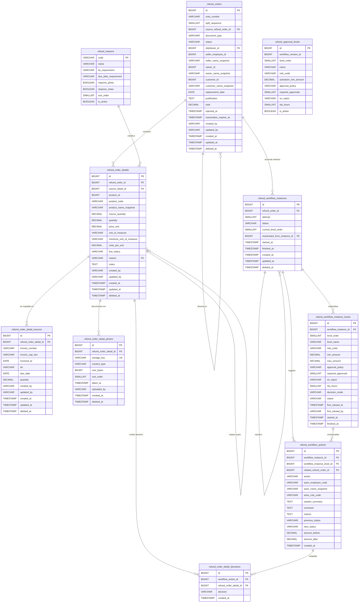

> `refund_approval_levels` aparece en el diagrama sin ninguna relación dibujada, y es a propósito: es configuración, no runtime. Cuando arranca un intento, sus niveles se copian a `refund_workflow_instance_levels` con monto, política, cantidad de aprobaciones, comportamiento al rechazar y SLA ya resueltos. Desde ahí en adelante el intento vive de esa copia, así que cambiar la configuración después no reescribe los documentos en curso y no hace falta una FK hacia el runtime.

### refund_orders

| Campo | Tipo | Regla |
|---|---|---|
| id | BIGINT PK | Lo genera nuestro servicio, no Sales. El endpoint de creación lo devuelve. |
| note_number | VARCHAR | Lo genera nuestro servicio. No es único por sí solo: la original y sus disociadas lo comparten. |
| split_sequence | SMALLINT | 0 en la original, se incrementa en cada disociada. Junto con el número forma la clave única. |
| source_refund_order_id | BIGINT FK nullable | Nulo en la original. En la disociada apunta a la nota de la que salió. |
| document_type | VARCHAR | CHECK de catálogo: ORIGINAL o DISSOCIATED. Solo DISSOCIATED admite edición de cantidades. |
| status | VARCHAR | Estado del documento, con CHECK de catálogo: IN_APPROVAL, EDITING, APPROVED, REJECTED, CANCELLED. Acompaña al de la instancia abierta: pasa a APPROVED al cerrar aprobada, a REJECTED al rechazar con TERMINATE y a CANCELLED al anular. |
| distributor_id | BIGINT FK | Única FK real hacia otro dominio: `distributors.id`. Distribuidora bajo la que se registró la nota. |
| seller_employee_id | BIGINT | Vendedor que registró la devolución. Referencia lógica a un servicio externo, sin FK. |
| seller_name_snapshot | VARCHAR | Nombre del vendedor al momento de registrar. Fotografía histórica para el documento. |
| owner_id | BIGINT | Propietario mostrado en pantalla. Referencia lógica, sin tabla local ni FK. |
| owner_name_snapshot | VARCHAR | Nombre histórico del propietario. Sobrevive a los cambios del sistema de origen. |
| customer_id | BIGINT | Cliente mostrado en pantalla. Referencia lógica, sin tabla local ni FK. |
| customer_name_snapshot | VARCHAR | Nombre histórico del cliente al momento de registrar. |
| replacement_date | DATE | Fecha de reposición declarada al registrar la devolución. |
| justification | TEXT | Justificación del documento. En una disociada en edición el vendedor puede modificarla. |
| total | DECIMAL | Único total del documento. Se recalcula al disociar y al reenviar una disociada editada. |
| rejected_at | TIMESTAMP nullable | Se escribe al rechazar con TERMINATE. Nulo mientras la nota no fue rechazada. |
| reactivation_expires_at | TIMESTAMP nullable | Se calcula al rechazar. La reactivación exige estar dentro de la ventana o tener permiso especial. |
| created_by | VARCHAR | Auditoría de creación. |
| updated_by | VARCHAR | Auditoría de última modificación. |
| created_at | TIMESTAMP | Fecha de registro de la nota. |
| updated_at | TIMESTAMP | Fecha de última modificación. |
| deleted_at | TIMESTAMP nullable | Borrado lógico. Las líneas nunca se eliminan físicamente. |

> La instancia activa no se guarda como puntero en la nota: se obtiene consultando `refund_workflow_instances`, donde un índice único parcial garantiza que exista como máximo una instancia abierta por nota.

### refund_order_details

| Campo | Tipo | Regla |
|---|---|---|
| id | BIGINT PK | Identificador de la línea. |
| refund_order_id | BIGINT FK | Nota a la que pertenece la línea. |
| source_detail_id | BIGINT FK nullable | Nulo en la nota original. En la disociada apunta a la línea de la que fue copiada, y por ahí se heredan las fotografías. |
| product_id | BIGINT | Producto devuelto. Referencia al catálogo externo. |
| product_code | VARCHAR | Fotografía histórica del código: el catálogo externo puede cambiar. |
| product_name_snapshot | VARCHAR | Fotografía histórica del nombre del producto. |
| source_quantity | DECIMAL | CHECK `source_quantity > 0`. Es el techo: la cantidad vigente nunca puede superarla. |
| quantity | DECIMAL | CHECK `quantity > 0` y `quantity <= source_quantity`. El vendedor solo puede reducirla, nunca aumentarla. |
| price_unit | DECIMAL | CHECK `price_unit >= 0`. Queda congelado: todo se valora con este precio y ningún nivel lo modifica. |
| unit_of_measure | VARCHAR nullable | Unidad de medida declarada, opcional. |
| minimum_unit_of_measure | VARCHAR nullable | Unidad mínima, opcional. |
| units_per_unit | DECIMAL nullable | Factor de conversión entre la unidad y la unidad mínima, opcional. |
| line_status | VARCHAR | CHECK `line_status IN ('ACTIVE','DISSOCIATED')`. La línea no seleccionada queda DISSOCIATED, no se borra. |
| reason | VARCHAR FK | Apunta a `refund_reasons.code`. Ya no admite texto libre. |
| notes | TEXT | Observaciones de la línea. Obligatorias si el motivo lo exige. Editables solo en una disociada en edición. |
| created_by · updated_by | VARCHAR | Auditoría de la línea. |
| created_at · updated_at | TIMESTAMP | Auditoría temporal. |
| deleted_at | TIMESTAMP nullable | Borrado lógico. El vendedor no puede eliminar líneas físicamente. |

### refund_order_detail_sources

| Campo | Tipo | Regla |
|---|---|---|
| id | BIGINT PK | Identificador del origen. |
| refund_order_detail_id | BIGINT FK | Línea que este origen respalda. |
| invoice_number | VARCHAR nullable | Número de factura. Puede faltar si hay documento SAP o lote. |
| invoice_sap_doc | VARCHAR nullable | Documento SAP de la factura. Puede faltar si hay número de factura o lote. |
| invoiced_at | DATE nullable | Fecha de facturación congelada al crear la devolución. |
| lot | VARCHAR nullable | Lote. Obligatorio cuando el motivo lo exige por `lot_requirement`. |
| due_date | DATE nullable | Vencimiento. Obligatorio cuando el motivo lo exige por `due_date_requirement`. |
| quantity | DECIMAL | CHECK `quantity > 0`. La suma de los orígenes de una línea tiene que dar exactamente la cantidad del detalle. |
| created_by · updated_by | VARCHAR | Auditoría del origen. |
| created_at · updated_at | TIMESTAMP | Auditoría temporal. |
| deleted_at | TIMESTAMP nullable | Borrado lógico. |

Además hay un CHECK a nivel de fila: `invoice_number IS NOT NULL OR invoice_sap_doc IS NOT NULL OR lot IS NOT NULL`. Un origen sin ninguna de las tres referencias no identifica nada. Así llega la línea en el contrato HTTP, con sus orígenes anidados:

```json
{ "productId": 501, "quantity": 15,
  "sources": [
    { "invoiceNumber": "F-100", "invoiceSapDoc": "100", "invoicedAt": "2026-08-01", "lot": "L01", "dueDate": "2027-01-01", "quantity": 10 },
    { "invoiceNumber": "F-200", "invoiceSapDoc": "200", "invoicedAt": "2026-08-10", "lot": "L02", "dueDate": "2027-02-01", "quantity": 5 }
  ] }
```

> La misma información tiene dos formas y conviene no confundirlas. En el contrato HTTP `sources` es un **array anidado dentro de la línea**. En PostgreSQL es **una fila por origen** en `refund_order_detail_sources`, cada una apuntando al detalle. La creación inserta el array como filas dentro de la misma transacción, y esa transacción valida `SUM(sources.quantity) = refund_order_details.quantity`. La regla vale también al editar: si el vendedor reduce la cantidad de la línea, ajusta las cantidades de sus orígenes en la misma transacción y la suma tiene que seguir coincidiendo exactamente. Lo que no puede hacer es inventar una factura o un lote que no venía en la nota de origen. Antes de crear la devolución las facturas y lotes elegibles pertenecen a SAP, que calcula la elegibilidad; al crearla, la selección utilizada queda congelada localmente acá.

### refund_order_detail_photos

| Campo | Tipo | Regla |
|---|---|---|
| id | BIGINT PK | Identificador de la fotografía. |
| refund_order_detail_id | BIGINT FK | Línea a la que la fotografía pertenece de forma propia. |
| storage_key | VARCHAR UNIQUE | Clave del archivo en el almacenamiento. Es única, y por eso el mismo archivo no puede registrarse dos veces. |
| content_type | VARCHAR nullable | Tipo MIME, opcional. |
| size_bytes | BIGINT nullable | Tamaño del archivo, opcional. |
| sort_order | SMALLINT | Orden de presentación de la galería. |
| taken_at | TIMESTAMP nullable | Fecha de captura, opcional. |
| uploaded_by | VARCHAR nullable | Quién subió el archivo, opcional. |
| created_at | TIMESTAMP | Fecha de registro. |
| deleted_at | TIMESTAMP nullable | Borrado lógico. |

> No hace falta guardar la `url` si puede derivarse de `storage_key`. Y en la disociación **el archivo no se duplica**: la línea de la nota disociada hereda las fotografías siguiendo su `source_detail_id` hacia la línea original. Si el vendedor agrega fotografías nuevas mientras edita, esas sí se guardan asociadas al detalle disociado. Al consultar el detalle, la respuesta devuelve las propias más las heredadas.

### refund_workflow_instances

| Campo | Tipo | Regla |
|---|---|---|
| id | BIGINT PK | Identificador del intento. |
| refund_order_id | BIGINT FK | Nota a la que pertenece el intento. |
| attempt | SMALLINT | Arranca en 1 y se incrementa en cada reactivación. De acá sale el número de reactivaciones, sin contador aparte. |
| status | VARCHAR | CHECK de catálogo: EDITING, IN_APPROVAL, APPROVED, REJECTED, CANCELLED. |
| current_level_order | SMALLINT | Nivel activo. Nulo en una disociada recién creada y en cualquier instancia cerrada. |
| reactivated_from_instance_id | BIGINT FK nullable | Apunta al intento rechazado del que nació esta reactivación. El intento anterior queda inmutable. |
| started_at | TIMESTAMP | Inicio del intento. |
| finished_at | TIMESTAMP | Cierre del intento. Se completa al aprobar, rechazar con TERMINATE o cancelar. |
| created_at · updated_at | TIMESTAMP | Auditoría temporal. |
| deleted_at | TIMESTAMP nullable | Borrado lógico. |

La disociada nace en `EDITING` y sin nivel activo. La original nace en `IN_APPROVAL` con el Nivel 1 activo. Solo puede existir una instancia abierta por nota, y una reactivación siempre crea otra instancia en vez de reabrir la anterior.

### refund_workflow_instance_levels

| Campo | Tipo | Regla |
|---|---|---|
| id | BIGINT PK | Identificador del nivel materializado. |
| workflow_instance_id | BIGINT FK | Intento al que pertenece el nivel. |
| level_order | SMALLINT | Posición del nivel en la escalera, de 1 a 4. |
| level_name | VARCHAR | Nombre copiado de la configuración al arrancar el intento. |
| role_code | VARCHAR | Rol que decide. Los aprobadores concretos se resuelven por rol, no se persisten. |
| min_amount | DECIMAL | Monto desde el cual el nivel se activa, congelado en el intento. |
| max_amount | DECIMAL | Techo del tramo, congelado en el intento. |
| approval_policy | VARCHAR | CHECK de catálogo. Define si alcanza una firma o si se exigen varias. |
| required_approvals | SMALLINT | Cantidad de firmas necesarias. Una persona firma una sola vez por nivel. |
| on_reject | VARCHAR | CHECK de catálogo con solo dos valores: TERMINATE y RETURN_PREVIOUS. El Nivel 1 no puede usar RETURN_PREVIOUS. |
| sla_hours | SMALLINT | Plazo esperado de decisión, copiado de la configuración. |
| decision_mode | VARCHAR | CHECK de catálogo. `ITEM_SELECTION` solo en el Nivel 1 del primer intento de una nota ORIGINAL; `DOCUMENT_DECISION` en los niveles 2 a 4, en las disociadas, en los intentos reactivados y en los niveles que regresan por RETURN_PREVIOUS. |
| status | VARCHAR | CHECK de catálogo: PENDING el nivel al que todavía no llegó el documento, ACTIVE el vigente, y APPROVED, REJECTED o SKIPPED los cerrados. Una instancia cerrada no puede dejar ningún nivel ACTIVE. |
| first_viewed_at | TIMESTAMP | Primera apertura del nivel. Abrir no cambia estados del documento. |
| first_viewed_by | VARCHAR | Quién lo abrió primero. |
| started_at | TIMESTAMP | Activación del nivel. |
| finished_at | TIMESTAMP | Cierre del nivel. |

### refund_workflow_actions

| Campo | Tipo | Regla |
|---|---|---|
| id | BIGINT PK | Identificador de la acción. La tabla es append-only. |
| workflow_instance_id | BIGINT FK | Intento en el que ocurrió la acción. Permite agrupar el historial por intento. |
| workflow_instance_level_id | BIGINT FK nullable | Nivel en el que ocurrió, cuando aplica. Las acciones fuera de un nivel lo dejan nulo. |
| related_refund_order_id | BIGINT FK nullable | Se usa únicamente en `DISSOCIATED_CREATED`, para apuntar a la nota disociada recién creada. |
| action | VARCHAR | CHECK de catálogo: CREATED, VIEWED, LEVEL1_ITEM_SELECTION, DISSOCIATED_CREATED, APPROVE, REJECT, RETURNED_PREVIOUS, SELLER_RESUBMITTED, AUTO_ROUTED, REACTIVATE, CANCEL, COMMENT, CLOSED. |
| actor_employee_code | VARCHAR nullable | Nulo en las acciones automáticas del sistema. |
| actor_name_snapshot | VARCHAR nullable | Nombre histórico del actor. Nulo en las acciones automáticas. |
| actor_role_code | VARCHAR nullable | Rol con el que actuó. Nulo en las acciones automáticas. |
| system_summary | TEXT | Resumen generado por el sistema para leer la bitácora sin interpretar campos sueltos. |
| comment | TEXT | Comentario libre de quien decide. |
| reason | TEXT | Obligatorio en REJECT, REACTIVATE y CANCEL. |
| previous_status | VARCHAR | Estado antes de la acción. |
| new_status | VARCHAR | Estado después de la acción. |
| amount_before | DECIMAL | Monto antes de la acción. Los movimientos de monto del historial salen de acá. |
| amount_after | DECIMAL | Monto después de la acción. |
| created_at | TIMESTAMP | Es la fecha efectiva de la acción. No existe otro campo de fecha en la tabla. |

### refund_order_detail_decisions

| Campo | Tipo | Regla |
|---|---|---|
| id | BIGINT PK | Identificador de la decisión por línea. |
| workflow_action_id | BIGINT FK | Acción `LEVEL1_ITEM_SELECTION` que produjo la decisión. Cuelga de la bitácora, así que hereda su inmutabilidad. |
| refund_order_detail_id | BIGINT FK | Línea decidida. |
| decision | VARCHAR | CHECK de catálogo: SELECTED o DISSOCIATED. Es binaria y por línea completa. |
| created_at | TIMESTAMP | Momento de la selección. |

No hay `approved_quantity` ni `approved_amount`: el Nivel 1 selecciona líneas completas, no cantidades ni montos parciales dentro de una línea.

### refund_reasons

| Campo | Tipo | Regla |
|---|---|---|
| code | VARCHAR PK | Clave del motivo. Es lo que referencia `refund_order_details.reason`. |
| name | VARCHAR | Etiqueta visible del motivo. |
| lot_requirement | VARCHAR | Define si el motivo exige lote en los orígenes de la línea. |
| due_date_requirement | VARCHAR | Define si el motivo exige fecha de vencimiento en los orígenes. |
| requires_photo | BOOLEAN | Si es verdadero, la línea no se acepta sin fotografía. |
| requires_notes | BOOLEAN | Si es verdadero, la línea no se acepta sin observaciones. |
| sort_order | SMALLINT | Orden de presentación en el formulario. |
| is_active | BOOLEAN | Un motivo inactivo deja de ofrecerse sin romper las notas históricas que lo usan. |

### refund_approval_levels

| Campo | Tipo | Regla |
|---|---|---|
| id | BIGINT PK | Identificador del nivel configurado. |
| workflow_version_id | BIGINT | Versión de la configuración a la que pertenece el nivel. |
| level_order | SMALLINT | Posición en la escalera: LVL1 Analista de Experiencia al Usuario, LVL2 Gerente de Experiencia al Usuario, LVL3 Gerente Comercial, LVL4 Gerente General. |
| name | VARCHAR | Nombre del nivel, que se copia al intento. |
| role_code | VARCHAR | Rol que decide en ese nivel. Los aprobadores se resuelven por rol. |
| activation_min_amount | DECIMAL | Monto desde el cual el nivel entra en juego. Los montos siguen siendo configurables. |
| approval_policy | VARCHAR | CHECK de catálogo. Define si alcanza una firma o si el nivel exige varias. |
| required_approvals | SMALLINT | Cantidad de firmas requeridas para dar por cerrado el nivel. |
| on_reject | VARCHAR | CHECK de catálogo con dos valores únicamente: TERMINATE y RETURN_PREVIOUS. |
| sla_hours | SMALLINT | Plazo esperado de decisión del nivel. |
| is_active | BOOLEAN | Un nivel inactivo deja de materializarse en los intentos nuevos, sin tocar los que ya están en curso. |

*Integridad*

## Lo que declara la base

Buena parte de las reglas de este módulo no viven en el servicio: viven en la base, como claves únicas, índices parciales y CHECK de catálogo. Esto es lo que el esquema declara y por qué.

- **`UNIQUE (note_number, split_sequence)`.** El número de nota por sí solo no puede ser único, porque la original y todas sus disociadas lo comparten: son el mismo documento de negocio partido en dos. Lo que distingue una fila de otra es el correlativo: 0 para la original y 1 en adelante para cada disociada. La unicidad se declara sobre el par.
- **Índice único parcial de una sola instancia abierta por nota.** Se declara sobre `refund_workflow_instances (refund_order_id)` con la condición `status IN ('EDITING','IN_APPROVAL')`. Reemplaza al puntero que antes vivía en la nota: en vez de mantener a mano una columna que apunte a la instancia vigente —y arriesgarse a que quede desincronizada—, la instancia activa se obtiene consultando la única fila abierta, y la base garantiza que nunca haya dos. Los intentos cerrados quedan fuera del índice, así que una nota puede acumular todos los intentos que haga falta.
- **FK real `refund_orders.distributor_id → distributors.id`.** La distribuidora sí es una tabla nuestra, así que la relación se declara de verdad y la base impide registrar una nota bajo una distribuidora que no existe.
- **Vendedor, propietario y cliente son referencias lógicas, sin FK.** Viven en servicios externos y no tienen tabla local, así que no hay integridad referencial que declarar. Lo que sí se guarda es `seller_name_snapshot`, `owner_name_snapshot` y `customer_name_snapshot`: el nombre tal como estaba al registrar. Eso permite mostrar el documento histórico aunque los otros sistemas renombren, fusionen o den de baja al empleado o al cliente.
- **CHECK de catálogo en todas las columnas de dominio cerrado.** `document_type` (ORIGINAL, DISSOCIATED), `status` del documento, `line_status` (ACTIVE, DISSOCIATED), `decision_mode` (ITEM_SELECTION, DOCUMENT_DECISION), el `status` del nivel (PENDING, ACTIVE, APPROVED, REJECTED, SKIPPED), `approval_policy`, `on_reject` con solo dos valores —TERMINATE y RETURN_PREVIOUS—, `action` con las trece acciones de la bitácora y `decision` con SELECTED y DISSOCIATED. Ninguna de esas columnas admite un valor que el servicio no sepa interpretar.
- **CHECK de coherencia del split.** Una nota ORIGINAL lleva `split_sequence = 0` y `source_refund_order_id` nulo; una DISSOCIATED lleva `split_sequence > 0` y `source_refund_order_id` obligatorio. La base no deja registrar una disociada huérfana ni una original que apunte a un padre.
- **CHECK de instancia cerrada sin nivel activo.** Si `status` está en APPROVED, REJECTED o CANCELLED, `current_level_order` tiene que ser nulo. No puede quedar un intento terminado con un nivel esperando decisión.
- **Motivo obligatorio en REJECT, REACTIVATE y CANCEL.** Un CHECK sobre `refund_workflow_actions` exige `reason` no nulo en esas tres acciones. Son las tres que cortan o reabren el recorrido, y ninguna puede quedar sin explicación en el historial.
- **`related_refund_order_id` solo en `DISSOCIATED_CREATED`.** Un CHECK lo obliga a ser nulo en cualquier otra acción. Es el único caso donde una acción se refiere a otra nota además de la suya: el momento en que la selección parcial crea la disociada.
- **Una firma por persona y por nivel.** Un índice único sobre el nivel del intento y el actor impide que la misma persona firme dos veces el mismo nivel para llegar al número de aprobaciones requeridas.
- **`refund_workflow_actions` es append-only.** No se actualiza nunca, no tiene columnas de modificación y no se presenta como tabla editable. Corregir el pasado no es actualizar una fila: es agregar otra acción. Por eso `created_at` alcanza como fecha efectiva y las decisiones por línea cuelgan de la acción, heredando su inmutabilidad.

> El script de creación elimina el esquema completo al principio, así que no lleva ningún `DROP TABLE refund_orders CASCADE` suelto antes de crear: sería redundante y da la falsa impresión de que esa tabla necesita un trato aparte.

*Endpoint 01*

## Registro de la devolución

```http
POST /api/v1/refunds — intake desde Sales
```

Sales tiene un único formulario de registro y no selecciona una venta previa ni envía identificadores propios: el documento nace acá. Nuestro servicio genera el `id` y el `note_number`, congela los nombres de vendedor, propietario y cliente, y persiste la evidencia elegida (facturas, lotes y fotografías) que hasta ese momento vivía en SAP. La nota nace como `ORIGINAL` con `split_sequence = 0` y su instancia de workflow arranca en `IN_APPROVAL` con el Nivel 1 activo en modo `ITEM_SELECTION`.

**Tablas:** `refund_reasons` · `refund_approval_levels` · `refund_orders` · `refund_order_details` · `refund_order_detail_sources` · `refund_order_detail_photos` · `refund_workflow_instances` · `refund_workflow_instance_levels` · `refund_workflow_actions`

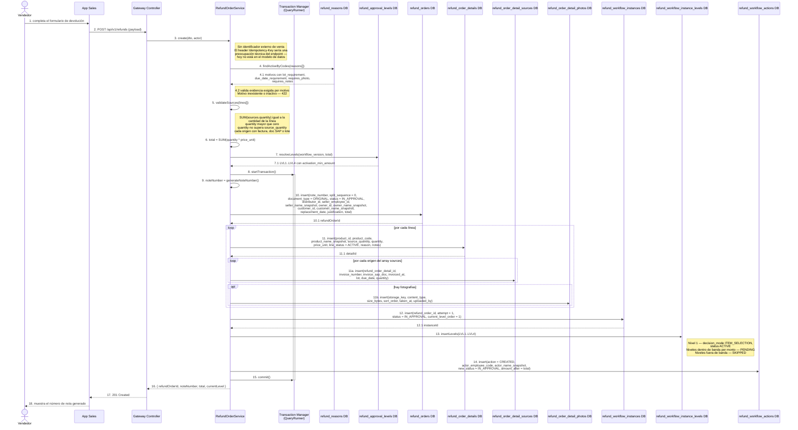

### Request

```json
{
  "distributorId": 501,
  "sellerEmployeeId": 8812,
  "sellerName": "Marcos Vaca",
  "ownerId": 3301,
  "ownerName": "Comercial Los Tajibos SRL",
  "customerId": 77120,
  "customerName": "Mini Market El Trompillo",
  "replacementDate": "2026-09-10",
  "justification": "Producto observado por el cliente en la entrega del 01/09.",
  "lines": [
    {
      "productId": 501,
      "productCode": "PRD-501",
      "productName": "Producto A",
      "sourceQuantity": 15,
      "quantity": 15,
      "priceUnit": 40.00,
      "unitOfMeasure": "CJ",
      "minimumUnitOfMeasure": "UN",
      "unitsPerUnit": 12,
      "reason": "DAMAGED",
      "notes": "Cajas golpeadas en el transporte.",
      "sources": [
        { "invoiceNumber": "F-100", "invoiceSapDoc": "100", "invoicedAt": "2026-08-01", "lot": "L01", "dueDate": "2027-01-01", "quantity": 10 },
        { "invoiceNumber": "F-200", "invoiceSapDoc": "200", "invoicedAt": "2026-08-10", "lot": "L02", "dueDate": "2027-02-01", "quantity": 5 }
      ],
      "photos": [
        { "storageKey": "refunds/2026/09/a1b2c3.jpg", "contentType": "image/jpeg", "sizeBytes": 184320, "sortOrder": 1, "takenAt": "2026-09-01T14:22:00Z" }
      ]
    },
    {
      "productId": 502,
      "productCode": "PRD-502",
      "productName": "Producto B",
      "sourceQuantity": 10,
      "quantity": 10,
      "priceUnit": 40.00,
      "reason": "NEAR_EXPIRY",
      "notes": "Vence dentro de los 30 días.",
      "sources": [
        { "invoiceNumber": "F-100", "invoiceSapDoc": "100", "invoicedAt": "2026-08-01", "lot": "L01", "dueDate": "2027-01-01", "quantity": 6 },
        { "invoiceNumber": "F-200", "invoiceSapDoc": "200", "invoicedAt": "2026-08-10", "lot": "L02", "dueDate": "2027-02-01", "quantity": 4 }
      ]
    }
  ]
}
```

### Response

```json
{
  "refundOrderId": 1001,
  "noteNumber": "235054",
  "splitSequence": 0,
  "documentType": "ORIGINAL",
  "status": "IN_APPROVAL",
  "total": 1000.00,
  "currentLevel": 1,
  "workflow": {
    "instanceId": 9001,
    "attempt": 1,
    "status": "IN_APPROVAL",
    "currentLevelOrder": 1,
    "levels": [
      { "levelOrder": 1, "levelName": "Analista de Experiencia al Usuario", "roleCode": "UX_ANALYST", "decisionMode": "ITEM_SELECTION", "status": "ACTIVE" },
      { "levelOrder": 2, "levelName": "Gerente de Experiencia al Usuario", "roleCode": "UX_MANAGER", "decisionMode": "DOCUMENT_DECISION", "status": "PENDING" },
      { "levelOrder": 3, "levelName": "Gerente Comercial", "roleCode": "COMMERCIAL_MANAGER", "decisionMode": "DOCUMENT_DECISION", "status": "SKIPPED" },
      { "levelOrder": 4, "levelName": "Gerente General", "roleCode": "GENERAL_MANAGER", "decisionMode": "DOCUMENT_DECISION", "status": "SKIPPED" }
    ]
  }
}
```

### Reglas

- El `note_number` y el `id` los genera nuestro servicio; Sales no aporta ningún identificador propio y la respuesta devuelve los dos.
- La nota no apunta a una venta: no hay campo de venta origen ni relación con el documento de Sales.
- Un eventual header `Idempotency-Key` sería una preocupación técnica del endpoint —deduplicación de reintentos HTTP— y no una relación de negocio; hoy no existe en el modelo de datos.
- Cada `reason` se valida contra `refund_reasons` activos. Código inexistente o inactivo devuelve 422 `REASON_NOT_FOUND`.
- El motivo manda la evidencia: con `requires_photo` sin fotografías, `lot_requirement` sin lote, `due_date_requirement` sin vencimiento o `requires_notes` sin observaciones, 422 `MISSING_EVIDENCE`.
- El array `sources[]` del contrato HTTP se persiste como una fila por origen en `refund_order_detail_sources`.
- Validación transaccional: `SUM(sources.quantity)` debe ser exactamente `refund_order_details.quantity`; si no, 422 `SOURCE_SUM_MISMATCH`.
- Cada origen exige al menos uno entre `invoice_number`, `invoice_sap_doc` o `lot`; 422 `SOURCE_WITHOUT_REFERENCE`.
- Restricciones de línea: `source_quantity > 0`, `quantity > 0`, `quantity <= source_quantity`, `price_unit >= 0`, `line_status = ACTIVE`.
- El total se calcula en el servidor con el `price_unit` congelado; un total enviado por el cliente se ignora.
- Se guardan los snapshots de vendedor, propietario y cliente. Son referencias lógicas a servicios externos: sin tablas locales ni claves foráneas.
- `distributor_id` sí tiene clave foránea real contra `distributors`; distribuidora inexistente devuelve 422.
- Se crea la instancia inicial en `IN_APPROVAL`, `attempt = 1`, con el Nivel 1 `ACTIVE` en `ITEM_SELECTION` y los niveles fuera de banda por monto en `SKIPPED`.
- Se registra `CREATED` en la bitácora append-only con `amount_after = total`.
- Todo ocurre en una sola transacción: cualquier fallo revierte la nota, sus líneas, sus orígenes, sus fotografías y su workflow.
- El índice único parcial garantiza una sola instancia abierta (`EDITING` o `IN_APPROVAL`) por nota.

*Endpoint 02*

## Bandeja de devoluciones

```http
GET /api/v1/refunds?status=&documentType=&distributorId=&sellerEmployeeId=&customerId=&noteNumber=&dateFrom=&dateTo=&page=&pageSize=&sort=
```

La bandeja lista notas, no workflows, pero cada fila necesita mostrar en qué punto de la aprobación está. Como no existe un puntero a la instancia activa dentro de la nota, la instancia vigente se resuelve buscando la única instancia abierta de cada nota —la que está en `EDITING` o `IN_APPROVAL`—, garantizada por el índice único parcial. Una nota cerrada no tiene instancia abierta: ahí se muestra el último intento y, si fue rechazada, la fecha límite de reactivación.

**Tablas:** `refund_orders` · `refund_workflow_instances` · `refund_workflow_instance_levels`

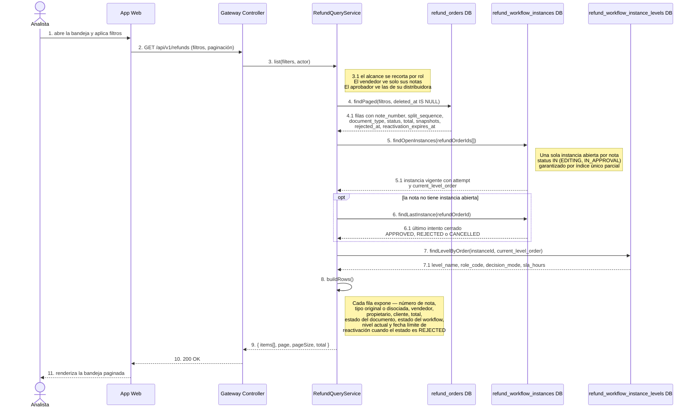

### Response

```json
{
  "items": [
    {
      "refundOrderId": 1001,
      "noteNumber": "235054",
      "splitSequence": 0,
      "documentType": "ORIGINAL",
      "status": "IN_APPROVAL",
      "sellerEmployeeId": 8812,
      "sellerName": "Marcos Vaca",
      "ownerId": 3301,
      "ownerName": "Comercial Los Tajibos SRL",
      "customerId": 77120,
      "customerName": "Mini Market El Trompillo",
      "total": 600.00,
      "workflow": {
        "instanceId": 9001,
        "attempt": 1,
        "status": "IN_APPROVAL",
        "currentLevelOrder": 2,
        "currentLevelName": "Gerente de Experiencia al Usuario",
        "decisionMode": "DOCUMENT_DECISION"
      },
      "reactivationExpiresAt": null,
      "createdAt": "2026-09-01T15:04:00Z"
    },
    {
      "refundOrderId": 1004,
      "noteNumber": "235054",
      "splitSequence": 1,
      "documentType": "DISSOCIATED",
      "sourceRefundOrderId": 1001,
      "status": "EDITING",
      "sellerEmployeeId": 8812,
      "sellerName": "Marcos Vaca",
      "ownerId": 3301,
      "ownerName": "Comercial Los Tajibos SRL",
      "customerId": 77120,
      "customerName": "Mini Market El Trompillo",
      "total": 400.00,
      "workflow": {
        "instanceId": 9002,
        "attempt": 1,
        "status": "EDITING",
        "currentLevelOrder": null,
        "currentLevelName": null,
        "decisionMode": null
      },
      "reactivationExpiresAt": null,
      "createdAt": "2026-09-02T10:11:00Z"
    },
    {
      "refundOrderId": 987,
      "noteNumber": "234901",
      "splitSequence": 0,
      "documentType": "ORIGINAL",
      "status": "REJECTED",
      "sellerName": "Ruth Áñez",
      "ownerName": "Distribuidora Norte SA",
      "customerName": "Almacén Doña Rosa",
      "total": 820.00,
      "workflow": {
        "instanceId": 8804,
        "attempt": 2,
        "status": "REJECTED",
        "currentLevelOrder": null,
        "currentLevelName": null,
        "decisionMode": null
      },
      "rejectedAt": "2026-08-28T19:40:00Z",
      "reactivationExpiresAt": "2026-09-04T19:40:00Z",
      "createdAt": "2026-08-20T09:00:00Z"
    }
  ],
  "page": 1,
  "pageSize": 25,
  "total": 3
}
```

### Reglas

- La instancia vigente se busca: es la única instancia de la nota con `status IN ('EDITING','IN_APPROVAL')`. No hay ningún puntero a la instancia activa guardado en la nota.
- El índice único parcial hace imposible encontrar dos instancias abiertas para la misma nota; si aparecieran, es un error de datos y no un caso a resolver en la consulta.
- Cada fila muestra número de nota, tipo original o disociada, vendedor, propietario, cliente, total, estado del documento, estado del workflow, nivel actual y la fecha límite de reactivación cuando corresponda.
- Una nota disociada en `EDITING` no tiene nivel activo: `currentLevelOrder` viaja en `null`.
- `reactivationExpiresAt` se expone únicamente cuando el estado es `REJECTED`; en el resto de los estados es `null`.
- El número de nota no es único: la original y sus disociadas lo comparten y se distinguen por `split_sequence`. Filtrar por `noteNumber` devuelve la familia completa.
- Se excluyen las filas con `deleted_at` no nulo.
- Los nombres que se listan son los snapshots del documento, no el valor actual de los servicios externos.
- El alcance se recorta por rol: un vendedor solo ve las notas donde es `seller_employee_id`. Filtrar fuera del alcance devuelve una página vacía, no 403.
- `pageSize` tiene tope de 100; por encima se responde 422 `INVALID_PAGE_SIZE`.
- Un rango con `dateFrom` posterior a `dateTo` devuelve 422 `INVALID_DATE_RANGE`.

*Endpoint 03*

## Detalle de la nota

```http
GET /api/v1/refunds/:id?includeHistory=true
```

El detalle es la vista completa del documento histórico: cabecera con los snapshots congelados, líneas valoradas con el `price_unit` del registro, los orígenes por factura y lote de cada línea, y las fotografías. Muestra además la familia —la original y sus disociadas—, los intentos con sus niveles y la bitácora de acciones, incluida la selección inicial del Nivel 1. En una nota disociada, las fotografías no se duplicaron: se heredan de la línea origen a través de `source_detail_id` y se devuelven junto con las propias.

**Tablas:** `refund_orders` · `refund_order_details` · `refund_order_detail_sources` · `refund_order_detail_photos` · `refund_workflow_instances` · `refund_workflow_instance_levels` · `refund_workflow_actions` · `refund_order_detail_decisions`

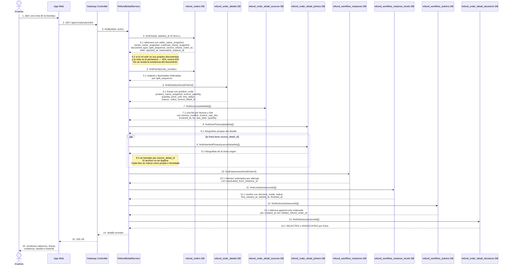

### Response

```json
{
  "refundOrderId": 1004,
  "noteNumber": "235054",
  "splitSequence": 1,
  "documentType": "DISSOCIATED",
  "sourceRefundOrderId": 1001,
  "status": "EDITING",
  "distributorId": 501,
  "sellerEmployeeId": 8812,
  "sellerNameSnapshot": "Marcos Vaca",
  "ownerId": 3301,
  "ownerNameSnapshot": "Comercial Los Tajibos SRL",
  "customerId": 77120,
  "customerNameSnapshot": "Mini Market El Trompillo",
  "replacementDate": "2026-09-10",
  "justification": "Producto observado por el cliente en la entrega del 01/09.",
  "total": 400.00,
  "rejectedAt": null,
  "reactivationExpiresAt": null,
  "family": [
    { "refundOrderId": 1001, "splitSequence": 0, "documentType": "ORIGINAL", "status": "IN_APPROVAL", "total": 600.00 },
    { "refundOrderId": 1004, "splitSequence": 1, "documentType": "DISSOCIATED", "status": "EDITING", "total": 400.00 }
  ],
  "details": [
    {
      "detailId": 7002,
      "sourceDetailId": 5002,
      "productId": 502,
      "productCode": "PRD-502",
      "productNameSnapshot": "Producto B",
      "sourceQuantity": 10,
      "quantity": 10,
      "priceUnit": 40.00,
      "lineTotal": 400.00,
      "lineStatus": "ACTIVE",
      "reason": "NEAR_EXPIRY",
      "notes": "Vence dentro de los 30 días.",
      "sources": [
        { "sourceId": 9101, "invoiceNumber": "F-100", "invoiceSapDoc": "100", "invoicedAt": "2026-08-01", "lot": "L01", "dueDate": "2027-01-01", "quantity": 6, "amount": 240.00 },
        { "sourceId": 9102, "invoiceNumber": "F-200", "invoiceSapDoc": "200", "invoicedAt": "2026-08-10", "lot": "L02", "dueDate": "2027-02-01", "quantity": 4, "amount": 160.00 }
      ],
      "photos": [
        { "photoId": 4410, "storageKey": "refunds/2026/09/d9e8f7.jpg", "sortOrder": 1, "origin": "INHERITED", "fromDetailId": 5002 }
      ]
    }
  ],
  "attempts": [
    {
      "instanceId": 9002,
      "attempt": 1,
      "status": "EDITING",
      "currentLevelOrder": null,
      "reactivatedFromInstanceId": null,
      "startedAt": "2026-09-02T10:11:00Z",
      "finishedAt": null,
      "levels": [
        { "levelOrder": 1, "levelName": "Analista de Experiencia al Usuario", "roleCode": "UX_ANALYST", "decisionMode": "DOCUMENT_DECISION", "status": "PENDING", "firstViewedAt": null, "firstViewedBy": null }
      ],
      "actions": [
        { "actionId": 6011, "action": "DISSOCIATED_CREATED", "relatedRefundOrderId": 1001, "actorEmployeeCode": null, "actorNameSnapshot": null, "systemSummary": "Nota disociada creada desde la nota 1001 por selección parcial del Nivel 1.", "amountBefore": null, "amountAfter": 400.00, "createdAt": "2026-09-02T10:11:00Z" }
      ]
    }
  ],
  "initialSelection": {
    "actionId": 6010,
    "sourceInstanceId": 9001,
    "decidedAt": "2026-09-02T10:11:00Z",
    "comment": "Se aprueba el Producto A; el Producto B se disocia para corrección del vendedor.",
    "items": [
      { "refundOrderDetailId": 5001, "productCode": "PRD-501", "decision": "SELECTED" },
      { "refundOrderDetailId": 5002, "productCode": "PRD-502", "decision": "DISSOCIATED" }
    ]
  }
}
```

### Reglas

- La cabecera se sirve con los snapshots del documento: el nombre histórico de vendedor, propietario y cliente, aunque los sistemas externos hayan cambiado.
- Las líneas incluyen `product_code` y `product_name_snapshot` congelados, y se valoran con el `price_unit` del registro.
- Los orígenes se devuelven como un array dentro de la línea; en PostgreSQL son una fila por factura y lote en `refund_order_detail_sources`. La suma de sus cantidades siempre coincide con la cantidad de la línea.
- Las fotografías se devuelven en dos grupos combinados: las propias del detalle y las heredadas por `source_detail_id`, marcadas con su origen. El archivo nunca se duplica.
- La familia se resuelve por `note_number` y se ordena por `split_sequence`: la original en 0 y cada disociada con su secuencia.
- Los intentos vienen ordenados por `attempt`, con `reactivated_from_instance_id` apuntando al intento rechazado del que salieron. Los intentos anteriores son inmutables.
- La bitácora es append-only y se ordena por `created_at`, que es la fecha efectiva de la acción; no hay otro campo de fecha.
- `related_refund_order_id` solo aparece en `DISSOCIATED_CREATED`.
- La selección inicial se reconstruye desde `refund_order_detail_decisions` con valores `SELECTED` o `DISSOCIATED`: son líneas completas, nunca cantidades ni montos aprobados.
- Un rol acotado a sus propios documentos que pide una nota ajena recibe 404 `REFUND_NOT_FOUND`, no 403: no se revela la existencia del documento.
- Una nota con `deleted_at` no nulo devuelve 404.
- La consulta es de solo lectura: no sella `first_viewed_at` ni registra `VIEWED`. Eso corresponde al endpoint de apertura de nivel.

*Endpoint 04*

## Apertura del nivel activo

```http
POST /api/v1/refunds/:id/levels/current/view
```

Registra que el aprobador del nivel activo abrió el documento, para poder medir el tiempo de respuesta contra el `sla_hours` del nivel. Sella `first_viewed_at` y `first_viewed_by` una sola vez —la primera apertura gana— y deja constancia con una acción `VIEWED`. Abrir un documento nunca cambia el estado de la nota, ni el de la instancia, ni el del nivel: es idempotente y repetirlo devuelve exactamente lo mismo.

**Tablas:** `refund_orders` · `refund_workflow_instances` · `refund_workflow_instance_levels` · `refund_workflow_actions`

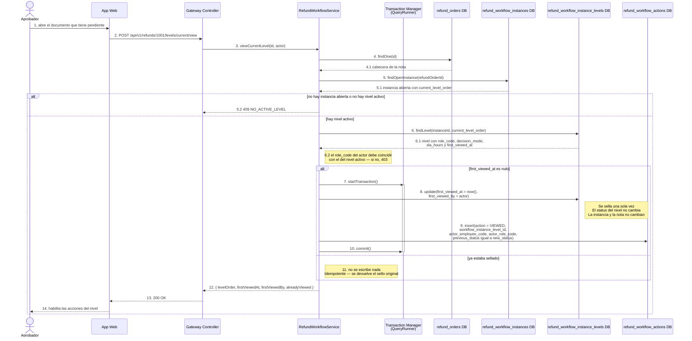

### Response

```json
{
  "refundOrderId": 1001,
  "workflowInstanceId": 9001,
  "attempt": 1,
  "levelOrder": 1,
  "levelName": "Analista de Experiencia al Usuario",
  "roleCode": "UX_ANALYST",
  "decisionMode": "ITEM_SELECTION",
  "levelStatus": "ACTIVE",
  "firstViewedAt": "2026-09-02T09:58:00Z",
  "firstViewedBy": "EMP-4471",
  "alreadyViewed": false,
  "slaHours": 24,
  "documentStatus": "IN_APPROVAL"
}
```

### Reglas

- La apertura no cambia estados: ni `refund_orders.status`, ni `refund_workflow_instances.status`, ni el `status` del nivel.
- `first_viewed_at` y `first_viewed_by` se sellan una única vez; la primera apertura gana y las siguientes no reescriben el sello.
- Es idempotente: las llamadas repetidas devuelven 200 con el sello original y `alreadyViewed = true`.
- El `VIEWED` de la bitácora se registra solo en el sellado efectivo, para no inflar el historial con cada apertura.
- Si la nota no tiene instancia abierta o la instancia no tiene nivel activo —por ejemplo una disociada en `EDITING`— se responde 409 `NO_ACTIVE_LEVEL`.
- El `role_code` del actor debe coincidir con el del nivel activo; si no, 403 `ROLE_NOT_ALLOWED`.
- El endpoint resuelve `current` desde `current_level_order` de la instancia abierta: el cliente no elige a qué nivel apunta.
- El sello vive en el nivel de la instancia, así que un intento reactivado tiene su propio `first_viewed_at` y no arrastra el del intento anterior.
- Nota inexistente, borrada o fuera del alcance del rol devuelve 404.

*Endpoint 05*

## Selección de ítems del Nivel 1

```http
POST /api/v1/refunds/:id/levels/1/item-selection
```

Es la única pantalla con casillas de todo el flujo y existe solo en el Nivel 1 del primer intento de una nota `ORIGINAL`. La decisión es binaria por línea completa: `SELECTED` o `DISSOCIATED`; nunca se tocan cantidades ni precios. Con selección total la nota sigue entera al nivel que le corresponde por monto. Con selección parcial la original se queda con lo seleccionado, recalcula su total y continúa inmediatamente —no espera a nadie—, mientras los ítems no seleccionados se van a una nota disociada nueva que nace en edición del vendedor.

**Tablas:** `refund_orders` · `refund_order_details` · `refund_order_detail_sources` · `refund_order_detail_photos` · `refund_approval_levels` · `refund_workflow_instances` · `refund_workflow_instance_levels` · `refund_workflow_actions` · `refund_order_detail_decisions`

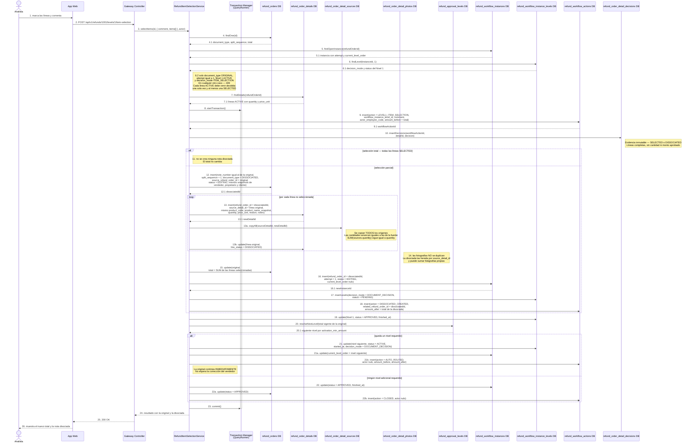

### Request

```json
{
  "comment": "Se aprueba el Producto A; el Producto B se disocia para corrección del vendedor.",
  "items": [
    { "refundOrderDetailId": 5001, "decision": "SELECTED" },
    { "refundOrderDetailId": 5002, "decision": "DISSOCIATED" }
  ]
}
```

### Response

```json
{
  "original": {
    "refundOrderId": 1001,
    "noteNumber": "235054",
    "splitSequence": 0,
    "documentType": "ORIGINAL",
    "status": "IN_APPROVAL",
    "totalBefore": 1000.00,
    "total": 600.00,
    "workflow": {
      "instanceId": 9001,
      "attempt": 1,
      "status": "IN_APPROVAL",
      "currentLevelOrder": 2,
      "currentLevelName": "Gerente de Experiencia al Usuario",
      "decisionMode": "DOCUMENT_DECISION"
    }
  },
  "dissociated": {
    "refundOrderId": 1004,
    "noteNumber": "235054",
    "splitSequence": 1,
    "documentType": "DISSOCIATED",
    "sourceRefundOrderId": 1001,
    "status": "EDITING",
    "total": 400.00,
    "workflow": {
      "instanceId": 9002,
      "attempt": 1,
      "status": "EDITING",
      "currentLevelOrder": null
    },
    "details": [
      {
        "detailId": 7002,
        "sourceDetailId": 5002,
        "productCode": "PRD-502",
        "quantity": 10,
        "priceUnit": 40.00,
        "sources": [
          { "invoiceNumber": "F-100", "lot": "L01", "quantity": 6 },
          { "invoiceNumber": "F-200", "lot": "L02", "quantity": 4 }
        ],
        "photosInherited": 1,
        "photosOwn": 0
      }
    ]
  },
  "actions": [
    { "action": "LEVEL1_ITEM_SELECTION", "workflowActionId": 6010, "amountBefore": 1000.00, "amountAfter": 600.00 },
    { "action": "DISSOCIATED_CREATED", "workflowActionId": 6011, "relatedRefundOrderId": 1004, "amountAfter": 400.00 },
    { "action": "AUTO_ROUTED", "workflowActionId": 6012, "actorEmployeeCode": null }
  ]
}
```

### Reglas

- Solo aplica al Nivel 1 del primer intento (`attempt = 1`) de una nota con `document_type = ORIGINAL` y `decision_mode = ITEM_SELECTION`. En cualquier otro caso, 409 `ITEM_SELECTION_NOT_ALLOWED`.
- La decisión es binaria por línea completa: `SELECTED` o `DISSOCIATED`. No se modifican cantidades, no se aprueban parciales dentro de una línea y no se cambian precios.
- Todas las líneas `ACTIVE` deben venir decididas exactamente una vez; faltantes o duplicadas devuelven 422 `INCOMPLETE_SELECTION`. Al menos una línea debe ser `SELECTED`.
- El comentario del analista es obligatorio y queda en la acción `LEVEL1_ITEM_SELECTION`.
- Selección total: no nace ninguna nota disociada, el total no cambia y la original continúa al nivel requerido por su monto.
- Selección parcial: la original conserva las líneas seleccionadas, recalcula `total` y continúa inmediatamente al Nivel 2 o al nivel que le corresponda por monto. No queda esperando la corrección del vendedor.
- Los no seleccionados generan una fila nueva en `refund_orders`: mismo `note_number`, otro `id`, `split_sequence` incrementado, `document_type = DISSOCIATED` y `source_refund_order_id` apuntando a la original.
- Se copian las líneas no seleccionadas con `source_detail_id` hacia la línea original, y se copian TODOS sus orígenes de `refund_order_detail_sources`, con cantidades iniciales iguales a las de la nota fuente.
- Las fotografías se heredan por `source_detail_id`: el archivo no se duplica. La disociada puede sumar fotografías propias y el detalle devuelve propias más heredadas.
- La línea original que se fue queda con `line_status = DISSOCIATED`: no se elimina físicamente.
- La disociada nace con instancia propia en `EDITING`, `attempt = 1`, sin nivel activo e historial independiente; sus niveles son todos `DOCUMENT_DECISION`.
- Se registra `DISSOCIATED_CREATED` con `related_refund_order_id` hacia la nota disociada; es la única acción que usa ese campo.
- La selección queda como evidencia inmutable en `refund_order_detail_decisions`, ligada a la acción; no se guardan cantidades ni montos aprobados por línea.
- El ruteo posterior es automático y va con actor nulo (`AUTO_ROUTED`); si el total recalculado no requiere niveles adicionales, la instancia cierra en `APPROVED` y se registra `CLOSED`.
- Todo ocurre en una sola transacción: si falla la copia de orígenes o la creación de la instancia, no se parte la nota.
- Reintentar sobre un Nivel 1 ya completado devuelve 409: la selección ocurre una sola vez por nota.

*Endpoint 06*

## Aprobar el nivel vigente

```http
`POST /api/v1/refunds/:id/levels/current/approve`
```

Cada persona firma una sola vez por nivel, y el nivel se cierra cuando la política configurada queda satisfecha — `ANY` con una firma, `ALL` con todos los aprobadores del rol, `QUORUM` con `required_approvals` firmas distintas. Al cerrarse el nivel, el monto vigente de la nota decide el destino: si cae dentro de la banda del nivel la nota se liquida ahí y los niveles superiores quedan `SKIPPED`; si la supera se abre el siguiente nivel y queda la huella `AUTO_ROUTED`. La aprobación final solamente cambia `refund_orders.status` a `APPROVED`, cierra la instancia y registra `CLOSED`.

> La liquidación (nota de crédito o intercambio físico) está fuera de alcance. Aprobar no escribe ningún campo de totales aprobados ni rechazados: el monto aprobado es `refund_orders.total` y los movimientos se leen desde la bitácora.

**Tablas:** `refund_orders` · `refund_workflow_instances` · `refund_workflow_instance_levels` · `refund_workflow_actions` · `refund_approval_levels`

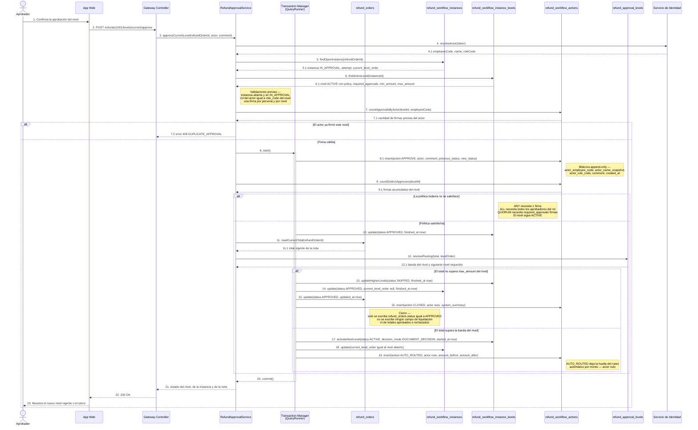

### Request

```json
{
  "comment": "Evidencia fotográfica completa y motivo válido."
}
```

### Response

```json
{
  "refundOrderId": 1001,
  "noteNumber": "235054",
  "attempt": 1,
  "level": { "levelOrder": 2, "name": "Gerente de Experiencia al Usuario", "status": "APPROVED" },
  "approvals": { "policy": "QUORUM", "requiredApprovals": 2, "collected": 2 },
  "skippedLevels": [3, 4],
  "instanceStatus": "APPROVED",
  "documentStatus": "APPROVED",
  "currentLevel": null,
  "total": 600.00
}
```

### Reglas

- La nota debe tener exactamente una instancia abierta y esa instancia debe estar en `IN_APPROVAL`. Si está en `EDITING` se responde `409 INSTANCE_NOT_IN_APPROVAL`.
- El `role_code` del actor tiene que coincidir con el del nivel vigente. Si no coincide, `403 ROLE_NOT_ALLOWED`.
- Una firma por persona y por nivel. Una segunda aprobación del mismo `actor_employee_code` sobre el mismo `workflow_instance_level_id` devuelve `409 DUPLICATE_APPROVAL`.
- `ANY` cierra el nivel con la primera firma. `ALL` exige la firma de todos los aprobadores resueltos por rol. `QUORUM` exige `required_approvals` firmas de personas distintas.
- Cerrado el nivel, la banda de montos decide: si el total vigente entra en la banda del nivel, los niveles superiores pasan a `SKIPPED` y la nota se aprueba ahí mismo.
- Si el total supera la banda, se abre el siguiente nivel con `decision_mode = DOCUMENT_DECISION` y se registra `AUTO_ROUTED` con actor nulo y el movimiento de monto.
- Ningún nivel distinto del Nivel 1 del primer intento de una nota `ORIGINAL` puede usar casillas: aprobar nunca acepta selección de líneas ni cantidades.
- Al cerrar la nota se escribe únicamente `refund_orders.status = APPROVED`, se cierra la instancia con `finished_at` y se registra `CLOSED`. La liquidación está fuera de alcance.
- El comentario es opcional en `APPROVE`; el motivo obligatorio aplica a `REJECT`, `REACTIVATE` y `CANCEL`.

*Endpoint 07*

## Rechazar el nivel vigente

```http
`POST /api/v1/refunds/:id/levels/current/reject`
```

El motivo es obligatorio y el destino del rechazo no lo elige quien rechaza: lo define `on_reject` del nivel configurado, y solo existen dos valores posibles. Con `TERMINATE` la nota muere: se cierra el nivel, la instancia queda `REJECTED`, la nota pasa a `REJECTED`, se guarda `rejected_at` y se calcula `reactivation_expires_at`. Con `RETURN_PREVIOUS` se reabre el nivel anterior y la instancia sigue en aprobación.

> Rechazar nunca habilita edición de cantidades. La edición existe únicamente para una nota `DISSOCIATED` cuya instancia esté en `EDITING`. El Nivel 1 no puede configurarse con `RETURN_PREVIOUS` porque no tiene nivel anterior.

**Tablas:** `refund_orders` · `refund_workflow_instances` · `refund_workflow_instance_levels` · `refund_workflow_actions` · `refund_reasons`

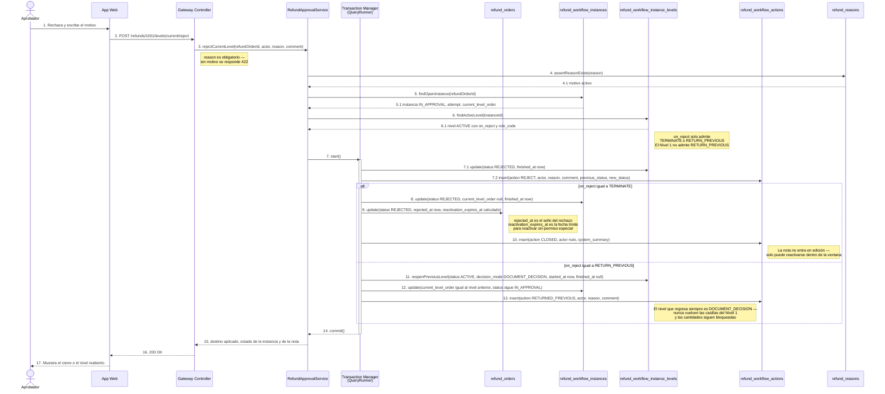

### Request

```json
{
  "reason": "EVIDENCIA_INSUFICIENTE",
  "comment": "Las fotografías no permiten identificar el lote declarado."
}
```

### Response — TERMINATE

```json
{
  "refundOrderId": 1001,
  "noteNumber": "235054",
  "attempt": 1,
  "onReject": "TERMINATE",
  "level": { "levelOrder": 2, "status": "REJECTED" },
  "instanceStatus": "REJECTED",
  "documentStatus": "REJECTED",
  "rejectedAt": "2026-08-31T15:20:00Z",
  "reactivationExpiresAt": "2026-09-07T15:20:00Z",
  "editingEnabled": false
}
```

### Response — RETURN_PREVIOUS

```json
{
  "refundOrderId": 1001,
  "noteNumber": "235054",
  "attempt": 1,
  "onReject": "RETURN_PREVIOUS",
  "level": { "levelOrder": 3, "status": "REJECTED" },
  "reopenedLevel": { "levelOrder": 2, "status": "ACTIVE", "decisionMode": "DOCUMENT_DECISION" },
  "instanceStatus": "IN_APPROVAL",
  "documentStatus": "IN_APPROVAL",
  "editingEnabled": false
}
```

### Reglas

- `reason` es obligatorio y tiene que existir y estar activo en `refund_reasons`. Sin motivo, `422 REASON_REQUIRED`.
- El destino se lee de `on_reject` del nivel vigente. Los únicos valores válidos del catálogo son `TERMINATE` y `RETURN_PREVIOUS`.
- Un Nivel 1 configurado con `RETURN_PREVIOUS` es una configuración inválida: no hay nivel anterior y se responde `409 NO_PREVIOUS_LEVEL`.
- Con `TERMINATE` se cierra el nivel, la instancia pasa a `REJECTED` sin nivel activo, la nota pasa a `REJECTED` y se escriben `rejected_at` y `reactivation_expires_at` en la misma transacción.
- Con `TERMINATE` se registran dos acciones: `REJECT` con actor y motivo, y `CLOSED` con actor nulo.
- Con `RETURN_PREVIOUS` el nivel anterior vuelve a `ACTIVE` con `decision_mode = DOCUMENT_DECISION`, la instancia sigue en `IN_APPROVAL` y se registra `RETURNED_PREVIOUS`.
- Rechazar no habilita edición de cantidades en ningún caso, ni siquiera sobre una nota disociada ya reenviada.
- Rechazar tampoco reabre la selección por casillas: las decisiones del Nivel 1 quedan congeladas en `refund_order_detail_decisions`.
- El actor debe pertenecer al `role_code` del nivel vigente; en caso contrario, `403 ROLE_NOT_ALLOWED`.

*Endpoint 08*

## Reactivar una nota rechazada

```http
`POST /api/v1/refunds/:id/reactivate`
```

Una nota rechazada puede volver a circular solamente si sigue dentro de la ventana de reactivación o si el actor tiene el permiso especial que la ignora. La reactivación no corrige el documento: crea otra fila en `refund_workflow_instances` con `attempt + 1` y `reactivated_from_instance_id` apuntando al intento rechazado, que queda inmutable. Todos los niveles del intento nuevo nacen en `DOCUMENT_DECISION`.

> No hay contador de reactivaciones: la cantidad de reactivaciones es la cantidad de intentos de la nota menos uno, leída de `refund_workflow_instances.attempt`.

**Tablas:** `refund_orders` · `refund_workflow_instances` · `refund_workflow_instance_levels` · `refund_workflow_actions` · `refund_approval_levels` · `refund_reasons`

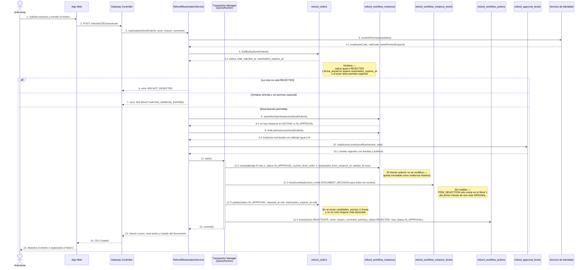

### Request

```json
{
  "reason": "DOCUMENTACION_COMPLETADA",
  "comment": "Se adjuntó la factura F-200 que faltaba en el primer intento."
}
```

### Response

```json
{
  "refundOrderId": 1001,
  "noteNumber": "235054",
  "documentType": "ORIGINAL",
  "documentStatus": "IN_APPROVAL",
  "instance": {
    "id": 7702,
    "attempt": 2,
    "status": "IN_APPROVAL",
    "currentLevelOrder": 1,
    "reactivatedFromInstanceId": 7701
  },
  "levels": [
    { "levelOrder": 1, "decisionMode": "DOCUMENT_DECISION", "status": "ACTIVE" },
    { "levelOrder": 2, "decisionMode": "DOCUMENT_DECISION", "status": "PENDING" }
  ],
  "reactivations": 1,
  "itemSelectionEnabled": false,
  "editingEnabled": false
}
```

### Reglas

- Solo se reactiva desde `status = REJECTED`. Cualquier otro estado responde `409 NOT_REJECTED`.
- La condición es `fecha_actual <= reactivation_expires_at` o que el actor tenga el permiso especial. Fuera de la ventana y sin ese permiso, `403 REACTIVATION_WINDOW_EXPIRED`.
- `reason` es obligatorio, igual que en el rechazo y en la anulación.
- El índice único parcial garantiza una sola instancia abierta por nota: si quedara alguna en `EDITING` o `IN_APPROVAL`, la inserción falla con `409 OPEN_INSTANCE_EXISTS`.
- La instancia nueva lleva `attempt + 1` y `reactivated_from_instance_id` apuntando al intento rechazado.
- El intento anterior queda inmutable: no se reabren sus niveles ni se corrigen sus acciones.
- Todos los niveles del intento nuevo nacen con `decision_mode = DOCUMENT_DECISION`. No hay casillas de selección en ninguna reactivación.
- Reactivar no permite editar cantidades, cambiar precios, agregar líneas ni crear otra nota disociada.
- No existe `reactivation_count`: la cantidad de reactivaciones se cuenta sobre los intentos registrados.
- Se registra `REACTIVATE` con actor, motivo y el movimiento de estado en `previous_status` y `new_status`.

*Endpoint 09*

## Editar las líneas de una nota disociada

```http
`PUT /api/v1/refunds/:id/items`
```

Es la única escritura que hace el vendedor sobre el documento y su llave es doble: `document_type = DISSOCIATED` y la instancia abierta en `EDITING`. Dentro de esa ventana puede reducir cantidades, cambiar observaciones y la justificación, y guardar todas las veces que quiera; no hay límite de guardados ni contador de ediciones. Toda reducción de cantidad obliga a ajustar los orígenes de la línea en la misma transacción, porque la suma de `refund_order_detail_sources.quantity` tiene que dar exactamente la cantidad vigente del detalle.

> Los orígenes vienen congelados desde la nota fuente. El vendedor puede bajar la cantidad de una factura o de un lote existente, incluso hasta soltarlo, pero no puede inventar una factura ni un lote que no venía de la nota origen.

**Tablas:** `refund_orders` · `refund_order_details` · `refund_order_detail_sources` · `refund_workflow_instances` · `refund_reasons`

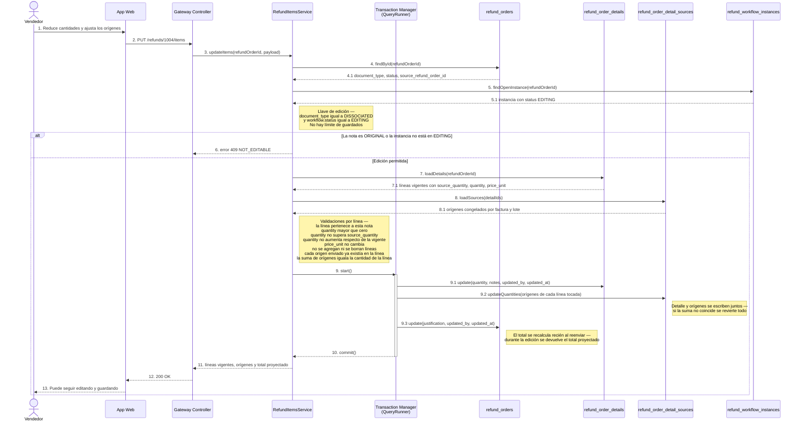

### Request

```json
{
  "justification": "El cliente aceptó devolver menos unidades del Producto B.",
  "items": [
    {
      "detailId": 7002,
      "quantity": 7,
      "notes": "Se retiran 7 de las 10 unidades apartadas.",
      "sources": [
        { "sourceId": 9101, "invoiceNumber": "F-100", "lot": "L01", "quantity": 5 },
        { "sourceId": 9102, "invoiceNumber": "F-200", "lot": "L02", "quantity": 2 }
      ]
    }
  ]
}
```

### Response

```json
{
  "refundOrderId": 1004,
  "noteNumber": "235054",
  "splitSequence": 1,
  "documentType": "DISSOCIATED",
  "sourceRefundOrderId": 1001,
  "workflowStatus": "EDITING",
  "projectedTotal": 280.00,
  "items": [
    {
      "detailId": 7002,
      "sourceDetailId": 5002,
      "productCode": "PRD-502",
      "sourceQuantity": 10,
      "quantity": 7,
      "priceUnit": 40.00,
      "sources": [
        { "sourceId": 9101, "invoiceNumber": "F-100", "invoiceSapDoc": "100", "lot": "L01", "quantity": 5 },
        { "sourceId": 9102, "invoiceNumber": "F-200", "invoiceSapDoc": "200", "lot": "L02", "quantity": 2 }
      ]
    }
  ]
}
```

### Reglas

- Solo edita una nota con `document_type = DISSOCIATED` cuya instancia abierta esté en `EDITING`. En cualquier otro caso, `409 NOT_EDITABLE`.
- Se puede guardar tantas veces como haga falta mientras la instancia siga en `EDITING`. No existe límite de un guardado ni contador de ediciones.
- Se permite reducir cantidades, cambiar `notes` de la línea y cambiar la `justification` de la nota.
- No se puede aumentar la cantidad vigente ni superar `source_quantity`: `422 QUANTITY_INCREASE_NOT_ALLOWED`.
- No se pueden agregar productos, borrar líneas físicamente ni modificar `price_unit`: el valor se calcula siempre con el precio congelado.
- No se puede tocar la nota original ni ninguna línea que no pertenezca a esta nota disociada.
- Al reducir una cantidad hay que ajustar los orígenes de esa línea en la misma transacción; `SUM(sources.quantity)` debe dar exactamente `refund_order_details.quantity`, si no, `422 SOURCES_SUM_MISMATCH` y rollback completo.
- Cada origen enviado tiene que existir ya en la línea, heredado de la nota fuente. Una factura o un lote nuevo devuelve `422 UNKNOWN_SOURCE`.
- Cada origen conserva la regla `quantity > 0` y al menos uno de `invoice_number`, `invoice_sap_doc` o `lot`.
- El total definitivo se recalcula al reenviar; durante la edición la respuesta expone un total proyectado.

*Endpoint 10*

## Reenviar la nota disociada a aprobación

```http
`POST /api/v1/refunds/:id/resubmit`
```

Cierra la ventana de edición del vendedor y devuelve la nota disociada al circuito de aprobación. Recalcula el total desde las líneas vigentes con el precio congelado, revalida que la suma de orígenes coincida línea por línea y activa el Nivel 1 en modo `DOCUMENT_DECISION`: el aprobador solo puede comentar, aprobar o rechazar. Queda la huella `SELLER_RESUBMITTED` con el monto anterior y el monto reenviado.

> Las casillas del Nivel 1 no vuelven nunca. `ITEM_SELECTION` existe solamente en el Nivel 1 del primer intento de una nota `ORIGINAL`; una disociada reenviada arranca siempre en `DOCUMENT_DECISION`.

**Tablas:** `refund_orders` · `refund_order_details` · `refund_order_detail_sources` · `refund_workflow_instances` · `refund_workflow_instance_levels` · `refund_workflow_actions`

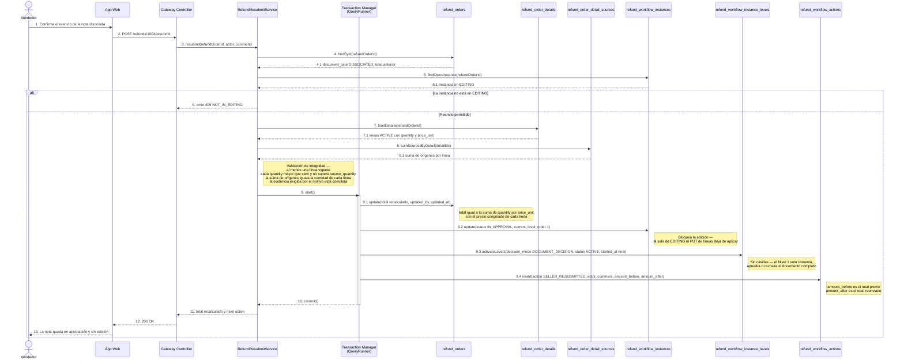

### Request

```json
{
  "comment": "Cantidades ajustadas junto con el cliente."
}
```

### Response

```json
{
  "refundOrderId": 1004,
  "noteNumber": "235054",
  "splitSequence": 1,
  "documentType": "DISSOCIATED",
  "documentStatus": "IN_APPROVAL",
  "instance": { "id": 7710, "attempt": 1, "status": "IN_APPROVAL", "currentLevelOrder": 1 },
  "level": { "levelOrder": 1, "decisionMode": "DOCUMENT_DECISION", "status": "ACTIVE" },
  "amountBefore": 400.00,
  "amountAfter": 280.00,
  "editingEnabled": false
}
```

### Reglas

- Solo se reenvía una nota `DISSOCIATED` cuya instancia abierta esté en `EDITING`; en otro caso, `409 NOT_IN_EDITING`.
- El reenvío bloquea la edición: al pasar la instancia a `IN_APPROVAL`, el `PUT /items` deja de aplicar.
- El total se recalcula como la suma de `quantity × price_unit` de las líneas vigentes, siempre con el precio congelado.
- Antes de escribir se revalida `SUM(sources.quantity) = refund_order_details.quantity` por cada línea; si falla, `422 SOURCES_SUM_MISMATCH` y no se reenvía nada.
- Una nota sin líneas vigentes no puede reenviarse: `422 NO_ACTIVE_ITEMS`.
- Se activa el Nivel 1 con `decision_mode = DOCUMENT_DECISION`. Nunca se activa con casillas de selección.
- Se registra `SELLER_RESUBMITTED` con `amount_before` y `amount_after`: el movimiento del monto se lee de la bitácora.
- Aprobado el Nivel 1, la nota continúa por los niveles que exija su monto recalculado, con el mismo ruteo automático del endpoint de aprobación.

*Endpoint 11*

## Anular la nota

```http
`POST /api/v1/refunds/:id/cancel`
```

Corta el circuito de una nota todavía abierta, sea que esté en edición o en aprobación, y siempre con motivo obligatorio. Los niveles que quedaban pendientes pasan a `SKIPPED`, la instancia cierra como `CANCELLED` y la nota queda anulada. La anulación es terminal: no se aprueba, no se edita y no se reactiva una nota anulada, porque la reactivación existe solo para el rechazo.

**Tablas:** `refund_orders` · `refund_workflow_instances` · `refund_workflow_instance_levels` · `refund_workflow_actions` · `refund_reasons`

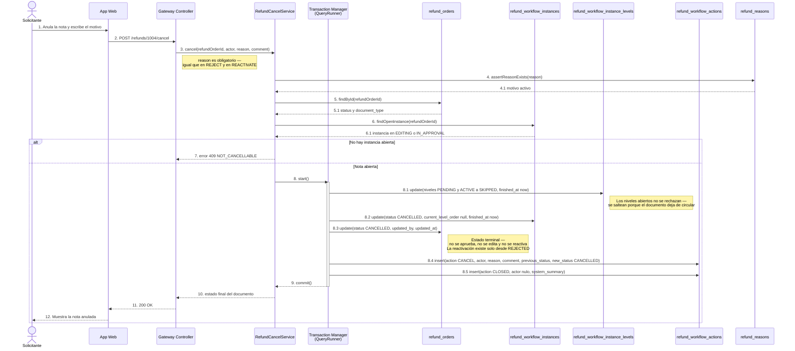

### Request

```json
{
  "reason": "SOLICITUD_DESISTIDA",
  "comment": "El cliente retiró el reclamo antes de la revisión."
}
```

### Response

```json
{
  "refundOrderId": 1004,
  "noteNumber": "235054",
  "splitSequence": 1,
  "documentType": "DISSOCIATED",
  "documentStatus": "CANCELLED",
  "instance": { "id": 7710, "attempt": 1, "status": "CANCELLED", "currentLevelOrder": null },
  "skippedLevels": [1, 2],
  "terminal": true
}
```

### Reglas

- Solo se anula una nota abierta, es decir con una instancia en `EDITING` o en `IN_APPROVAL`. Sobre una nota ya `APPROVED`, `REJECTED` o `CANCELLED` se responde `409 NOT_CANCELLABLE`.
- `reason` es obligatorio y debe existir en `refund_reasons`: sin motivo, `422 REASON_REQUIRED`.
- Todos los niveles abiertos, `PENDING` o `ACTIVE`, pasan a `SKIPPED` con `finished_at`; no se registran como rechazados.
- La instancia cierra en `CANCELLED` sin nivel activo y la nota queda en `CANCELLED`.
- La anulación es terminal: no habilita edición, no admite reactivación y no crea otro intento. La ventana de reactivación pertenece solamente al rechazo.
- Anular la nota original no anula automáticamente su nota disociada: cada fila de `refund_orders` tiene su propio workflow y se anula por separado.
- Se registran `CANCEL` con actor y motivo, y `CLOSED` con actor nulo, ambas en la bitácora append-only.
- No se escribe ningún campo de liquidación ni de totales: `refund_orders.total` conserva el valor que tenía al anularse, como evidencia histórica.

*Endpoint 12*

## Historial de la nota

```http
GET /api/v1/refunds/:id/history
```

Devuelve la bitácora completa de la nota agrupada por intento. Cada intento es una fila de `refund_workflow_instances` y ordena sus acciones por `created_at`, que es la fecha efectiva de cada hecho: no existe ningún otro campo de fecha en la acción. La bitácora es append-only, de modo que el historial nunca se corrige hacia atrás, solamente crece.

**Tablas:** `refund_orders` · `refund_workflow_instances` · `refund_workflow_instance_levels` · `refund_workflow_actions` · `refund_order_detail_decisions` · `refund_order_details`

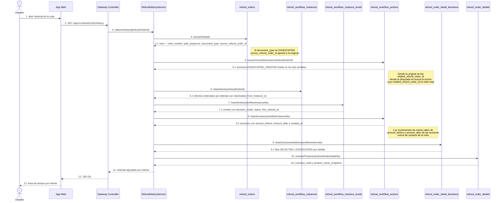

### Response

```json
{
  "refundOrderId": 1001,
  "noteNumber": "235054",
  "documentType": "ORIGINAL",
  "family": {
    "originalRefundOrderId": 1001,
    "dissociatedRefundOrderIds": [1004],
    "linkSource": "refund_workflow_actions.DISSOCIATED_CREATED"
  },
  "attempts": [
    {
      "workflowInstanceId": 7001,
      "attempt": 1,
      "status": "IN_APPROVAL",
      "reactivatedFromInstanceId": null,
      "actions": [
        {
          "id": 90001,
          "action": "CREATED",
          "actorName": "Vendedor Perez",
          "amountBefore": null,
          "amountAfter": 1000.00,
          "createdAt": "2026-08-20T09:12:00Z"
        },
        {
          "id": 90003,
          "action": "LEVEL1_ITEM_SELECTION",
          "actorRoleCode": "UX_ANALYST",
          "amountBefore": 1000.00,
          "amountAfter": 600.00,
          "createdAt": "2026-08-20T11:40:00Z",
          "itemDecisions": [
            { "refundOrderDetailId": 5001, "productCode": "PRD-501", "decision": "SELECTED" },
            { "refundOrderDetailId": 5002, "productCode": "PRD-502", "decision": "DISSOCIATED" }
          ]
        },
        {
          "id": 90004,
          "action": "DISSOCIATED_CREATED",
          "relatedRefundOrderId": 1004,
          "amountBefore": null,
          "amountAfter": 400.00,
          "createdAt": "2026-08-20T11:40:00Z"
        }
      ]
    }
  ]
}
```

### Reglas

- Las acciones se agrupan por intento: cada grupo corresponde a una fila de `refund_workflow_instances` y se ordena por `attempt` ascendente.
- El intento reactivado se encadena con el anterior por `reactivated_from_instance_id`; los intentos previos quedan inmutables y se muestran tal como cerraron.
- El vínculo entre la original y su disociada se resuelve por la fila puente `DISSOCIATED_CREATED`, leída en los dos sentidos: desde la original por `related_refund_order_id`, desde la disociada buscando la acción que la nombra.
- `related_refund_order_id` solo tiene valor en `DISSOCIATED_CREATED`; en cualquier otra acción viaja nulo y no debe interpretarse.
- La selección por ítem se lee de `refund_order_detail_decisions`, que cuelga de la acción `LEVEL1_ITEM_SELECTION` y solo admite `SELECTED` o `DISSOCIATED`: es una decisión por línea completa, sin cantidades aprobadas.
- Los movimientos de monto se reconstruyen exclusivamente con `amount_before` y `amount_after` de cada acción; la nota no guarda montos parciales de ningún tipo.
- `created_at` es la fecha efectiva de la acción: no hay otro campo de fecha y no se sobrescribe.
- Las acciones automáticas, como `AUTO_ROUTED` o `CLOSED` por sistema, llegan con actor nulo y se muestran atribuidas al sistema.
- `refund_workflow_actions` es append-only: el endpoint es de solo lectura y nunca corrige ni elimina filas.
- Los nombres que se muestran salen de los snapshots (`actor_name_snapshot`, `product_name_snapshot`) para que el historial siga siendo legible aunque los sistemas externos cambien.

*Endpoint 13*

## Escalera de aprobación

```http
GET · POST /api/v1/refund-approval-levels
```

El `GET` devuelve la versión activa de la escalera de niveles. El `POST` publica una versión nueva y archiva la anterior en la misma transacción. Las instancias en curso no se ven afectadas, porque al arrancar congelaron su propia copia de los niveles en `refund_workflow_instance_levels`.

**Tablas:** `refund_approval_levels` · `refund_workflow_instance_levels` · `refund_workflow_instances`

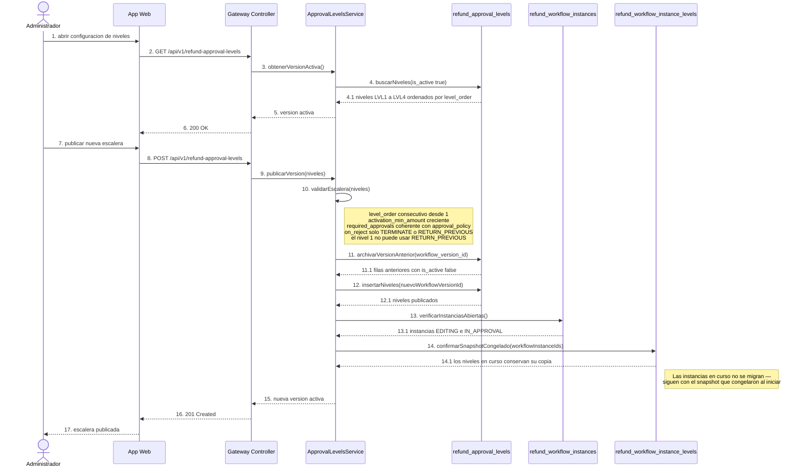

### Response

```json
{
  "workflowVersionId": 12,
  "isActive": true,
  "levels": [
    {
      "levelOrder": 1,
      "name": "Analista de Experiencia al Usuario",
      "roleCode": "UX_ANALYST",
      "activationMinAmount": 0.00,
      "approvalPolicy": "ANY",
      "requiredApprovals": 1,
      "onReject": "TERMINATE",
      "slaHours": 24
    },
    {
      "levelOrder": 2,
      "name": "Gerente de Experiencia al Usuario",
      "roleCode": "UX_MANAGER",
      "activationMinAmount": 500.00,
      "approvalPolicy": "ANY",
      "requiredApprovals": 1,
      "onReject": "RETURN_PREVIOUS",
      "slaHours": 24
    },
    {
      "levelOrder": 3,
      "name": "Gerente Comercial",
      "roleCode": "COMMERCIAL_MANAGER",
      "activationMinAmount": 5000.00,
      "approvalPolicy": "ALL",
      "requiredApprovals": 1,
      "onReject": "TERMINATE",
      "slaHours": 48
    },
    {
      "levelOrder": 4,
      "name": "Gerente General",
      "roleCode": "GENERAL_MANAGER",
      "activationMinAmount": 20000.00,
      "approvalPolicy": "QUORUM",
      "requiredApprovals": 2,
      "onReject": "TERMINATE",
      "slaHours": 72
    }
  ]
}
```

### Reglas

- El `GET` siempre devuelve la versión con `is_active = true`; existe exactamente una versión activa por vez.
- Publicar es atómico: archivar la versión anterior e insertar la nueva ocurre en una sola transacción, para que nunca haya cero ni dos versiones activas.
- Las instancias en curso no se ven afectadas porque congelaron su snapshot en `refund_workflow_instance_levels` al iniciar; una nota que ya está aprobándose termina con las reglas con las que empezó.
- `level_order` debe ser consecutivo desde 1 y `activation_min_amount` estrictamente creciente entre niveles.
- `required_approvals` tiene que ser coherente con `approval_policy`: 1 en `ANY`, la cantidad de firmantes en `ALL`, y un número mayor a 1 y menor que el total en `QUORUM`.
- `on_reject` solo admite `TERMINATE` y `RETURN_PREVIOUS`: rechazar nunca devuelve el documento a edición de cantidades.
- El Nivel 1 no puede configurarse con `RETURN_PREVIOUS` porque no tiene nivel anterior al que volver.
- Los cuatro niveles confirmados son LVL1 Analista de Experiencia al Usuario, LVL2 Gerente de Experiencia al Usuario, LVL3 Gerente Comercial y LVL4 Gerente General; los montos de activación siguen siendo configurables.
- `role_code` es la única referencia a personas: la escalera nombra roles, nunca empleados.

*Endpoint 14*

## Aprobadores del nivel actual

```http
GET /api/v1/refunds/:id/approvers
```

Devuelve quiénes pueden firmar el nivel activo de la nota. La resolución se hace por `role_code` contra el directorio externo de empleados en el momento de la consulta: no se persisten empleados asignados en ninguna tabla local.

**Tablas:** `refund_orders` · `refund_workflow_instances` · `refund_workflow_instance_levels` · `refund_workflow_actions` · `Directorio de Empleados (externo)`

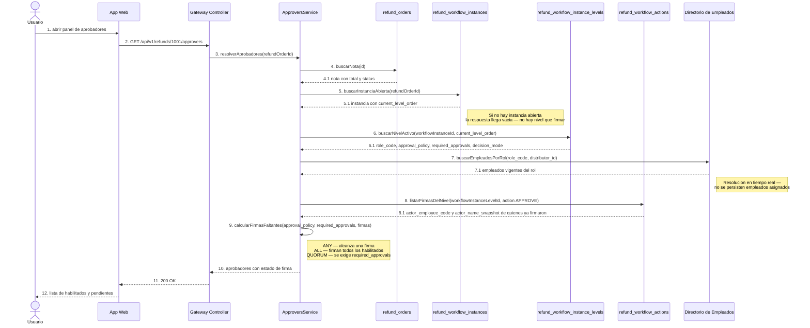

### Response

```json
{
  "refundOrderId": 1001,
  "workflowInstanceId": 7001,
  "currentLevelOrder": 2,
  "levelName": "Gerente de Experiencia al Usuario",
  "roleCode": "UX_MANAGER",
  "decisionMode": "DOCUMENT_DECISION",
  "approvalPolicy": "ANY",
  "requiredApprovals": 1,
  "signaturesCollected": 0,
  "signaturesMissing": 1,
  "approvers": [
    { "employeeCode": "E-4410", "name": "Lucia Vargas", "roleCode": "UX_MANAGER", "hasSigned": false },
    { "employeeCode": "E-4432", "name": "Marcos Rios", "roleCode": "UX_MANAGER", "hasSigned": false }
  ],
  "resolution": "role_code contra el directorio externo, sin persistencia local"
}
```

### Reglas

- Los aprobadores se resuelven por `role_code` del nivel activo contra el directorio externo, filtrando por la distribuidora de la nota.
- No se persisten empleados asignados: no existe tabla de asignaciones y el resultado puede cambiar entre dos consultas si el directorio cambia.
- El `role_code` que manda es el congelado en `refund_workflow_instance_levels`, no el de la versión activa de la escalera.
- Las firmas necesarias dependen de la política: `ANY` exige una firma, `ALL` exige la de todos los habilitados y `QUORUM` exige `required_approvals` firmas.
- Quién ya firmó se deriva de las acciones `APPROVE` del nivel en `refund_workflow_actions`, no de un campo de estado por persona.
- Un mismo empleado cuenta una sola vez aunque aparezca más de una acción suya sobre el nivel.
- Si la nota no tiene instancia abierta, o la instancia está en `EDITING`, no hay nivel activo y la lista vuelve vacía.
- El endpoint es de solo lectura: consultar aprobadores no registra la apertura del nivel ni cambia estados.

*Endpoint 15*

## Productos devolubles

```http
GET /api/v1/refunds/returnable-products
```

Consulta previa al formulario. SAP calcula la elegibilidad de cada producto y devuelve las facturas y lotes posibles con su cantidad disponible. Durante esta consulta la devolución todavía no existe: esos datos siguen perteneciendo a SAP. Recién al crear la nota, los orígenes elegidos quedan congelados localmente como filas de `refund_order_detail_sources`.

**Tablas:** `SAP (externo)` · `refund_reasons` · `refund_orders` · `refund_order_details` · `refund_order_detail_sources`

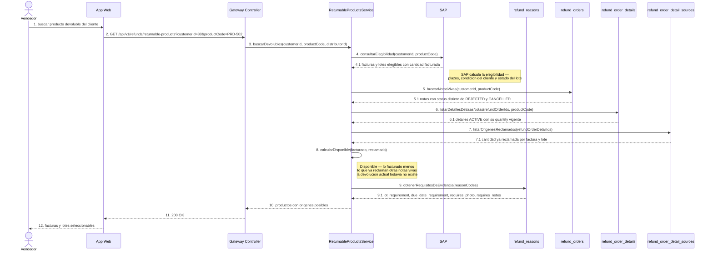

### Response

```json
{
  "customerId": 88,
  "products": [
    {
      "productId": 502,
      "productCode": "PRD-502",
      "productName": "Producto B",
      "unitOfMeasure": "CAJA",
      "priceUnit": 20.00,
      "eligibleSources": [
        {
          "invoiceNumber": "F-100",
          "invoiceSapDoc": "100",
          "invoicedAt": "2026-08-01",
          "lot": "L01",
          "dueDate": "2027-01-01",
          "invoicedQuantity": 18,
          "alreadyClaimedQuantity": 0,
          "availableQuantity": 18
        },
        {
          "invoiceNumber": "F-200",
          "invoiceSapDoc": "200",
          "invoicedAt": "2026-08-10",
          "lot": "L02",
          "dueDate": "2027-02-01",
          "invoicedQuantity": 12,
          "alreadyClaimedQuantity": 2,
          "availableQuantity": 10
        }
      ]
    }
  ],
  "note": "Los origenes se congelan en refund_order_detail_sources recien al crear la nota"
}
```

### Reglas

- SAP es la autoridad de elegibilidad: decide qué facturas y lotes pueden devolverse y con qué cantidad facturada.
- La devolución todavía no existe durante esta consulta: no se escribe ninguna fila, no se reserva stock y el resultado no compromete a nadie.
- Lo disponible es lo facturado menos lo que ya reclaman otras notas vivas, es decir las que no están rechazadas ni canceladas.
- El descuento por notas vivas se calcula sumando `refund_order_detail_sources.quantity` por factura y lote, no por producto en bruto.
- Al crear la nota, los orígenes elegidos quedan congelados en `refund_order_detail_sources` como una fila por origen, con la cantidad tomada de cada uno.
- En el contrato HTTP los orígenes viajan como un array dentro de la línea; en PostgreSQL son filas relacionadas.
- La suma de las cantidades de los orígenes elegidos debe ser exactamente la cantidad de la línea; esa validación es transaccional al crear.
- El motivo elegido define qué evidencia se exige (`lot_requirement`, `due_date_requirement`, `requires_photo`, `requires_notes`), así que la consulta ya devuelve esos requisitos para validar en pantalla.
- Entre esta consulta y la creación puede pasar tiempo: la disponibilidad se vuelve a validar al momento de crear, porque otra nota pudo tomar el mismo lote.

*Endpoint 16*

## Comentar la nota

```http
POST /api/v1/refunds/:id/comments
```

Agrega un comentario a la bitácora del documento. No cambia el estado de la nota, no cierra ni abre niveles y no consume la firma del nivel: queda simplemente como una acción `COMMENT` en `refund_workflow_actions`.

**Tablas:** `refund_orders` · `refund_workflow_instances` · `refund_workflow_instance_levels` · `refund_workflow_actions`

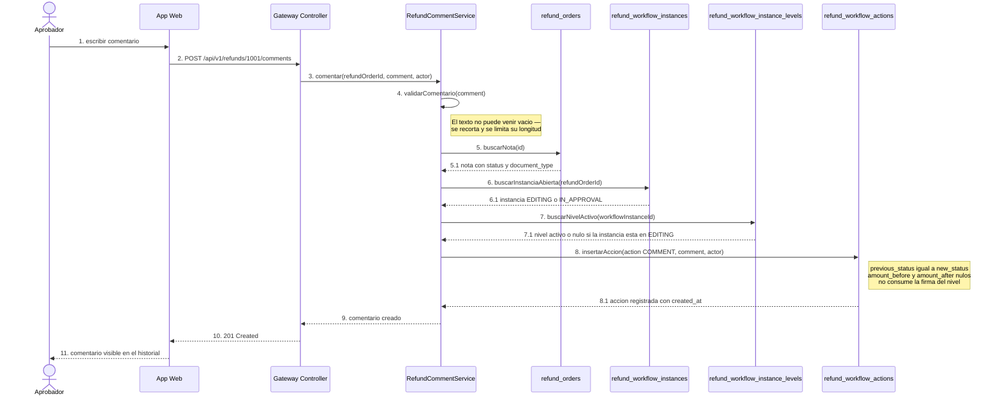

### Response

```json
{
  "workflowActionId": 90012,
  "refundOrderId": 1001,
  "workflowInstanceId": 7001,
  "workflowInstanceLevelId": 8102,
  "action": "COMMENT",
  "actorEmployeeCode": "E-4410",
  "actorNameSnapshot": "Lucia Vargas",
  "actorRoleCode": "UX_MANAGER",
  "comment": "Falta la fotografia del lote L02",
  "previousStatus": "IN_APPROVAL",
  "newStatus": "IN_APPROVAL",
  "createdAt": "2026-08-21T14:05:00Z"
}
```

### Reglas

- Comentar no cambia estados: `previous_status` y `new_status` quedan iguales y la nota sigue exactamente donde estaba.
- No consume la firma del nivel: un aprobador puede comentar todas las veces que quiera y después aprobar o rechazar.
- La acción se registra como `COMMENT` en `refund_workflow_actions`, con el actor y su `actor_name_snapshot`.
- Si hay nivel activo, la acción se ata a él por `workflow_instance_level_id`; si la instancia está en `EDITING`, ese campo queda nulo.
- El comentario se ata siempre a la instancia abierta de la nota; una nota sin instancia abierta no admite comentarios nuevos.
- No se escriben `amount_before` ni `amount_after`: comentar no es un movimiento de monto.
- El texto es obligatorio y no vacío; queda inmutable, porque la bitácora es append-only y no se edita ni se borra.
- Una nota disociada en edición también admite comentarios, y quedan en su propio historial, separado del de la original.

*Ejemplo*

## Nota 235054, paso a paso

El vendedor registra la nota 235054 por Bs 1.000 con dos líneas: Producto A por Bs 600 y Producto B por Bs 400. El Nivel 1 abre el documento, ve las casillas porque es el primer intento de una nota original, y selecciona únicamente el Producto A.

### 1. Estado inicial

Una sola fila en `refund_orders` con `id = 1001` y dos líneas en `refund_order_details`. El workflow nace `IN_APPROVAL` con el Nivel 1 en modo `ITEM_SELECTION`.

| Línea | Producto | Cantidad | price_unit | Valor | line_status |
|---|---|---|---|---|---|
| 5001 | Producto A · PRD-501 | 15 | 40.00 | 600.00 | ACTIVE |
| 5002 | Producto B · PRD-502 | 10 | 40.00 | 400.00 | ACTIVE |
| **Total de la nota** |  |  |  | **1000.00** | ORIGINAL |

### 2. Después de la selección del Nivel 1

El Producto A queda `SELECTED` y el Producto B `DISSOCIATED`. La original recalcula su total a Bs 600 y avanza inmediatamente al Nivel 2; los ítems no seleccionados generan una segunda fila con el mismo `note_number`, otro `id` y `split_sequence` incrementado.

| id | note_number | split_sequence | source_refund_order_id | document_type | total | workflow |
|---|---|---|---|---|---|---|
| 1001 | 235054 | 0 | null | ORIGINAL | 600.00 | IN_APPROVAL — esperando Nivel 2 |
| 1004 | 235054 | 1 | 1001 | DISSOCIATED | 400.00 | EDITING |

```text
refund_orders.id = 1001, note_number = 235054, split_sequence = 0,
  source_refund_order_id = null, document_type = ORIGINAL,
  total = 600.00, workflow = IN_APPROVAL esperando Nivel 2

refund_orders.id = 1004, note_number = 235054, split_sequence = 1,
  source_refund_order_id = 1001, document_type = DISSOCIATED,
  total = 400.00, workflow = EDITING, attempt = 1
```

La original no espera nada del vendedor: sigue su curso con Bs 600. La línea 5002 queda en la original con `line_status = DISSOCIATED` y no se borra. La disociada arranca con historial propio, `attempt = 1` y sin nivel activo, porque está en edición.

### 3. El Producto B llega con dos orígenes

La línea 5002 se copia a la disociada como línea 7002 con `source_detail_id = 5002`, y se copian TODOS sus orígenes, cada uno atado al detalle nuevo. Las cantidades de origen arrancan iguales a las de la nota fuente y su suma es exactamente la cantidad de la línea.

| Origen | Factura | invoice_sap_doc | Lote | Vencimiento | Cantidad | Valor |
|---|---|---|---|---|---|---|
| 9101 | F-100 | 100 | L01 | 2027-01-01 | 6 | 240.00 |
| 9102 | F-200 | 200 | L02 | 2027-02-01 | 4 | 160.00 |
| **Suma de orígenes** |  |  |  |  | **10** | **400.00** |
| **Cantidad del detalle 7002** |  |  |  |  | **10** | **400.00** |

Con `price_unit` congelado en Bs 40,00: 6 × 40 = Bs 240 y 4 × 40 = Bs 160, que suman los Bs 400 de la línea. Las fotografías no se duplican: la línea 7002 hereda las del detalle 5002 por `source_detail_id`.

### 4. El vendedor reduce la cantidad

Mientras la disociada siga en `EDITING`, el vendedor puede bajar la cantidad de la línea 7002 de 10 a 7 unidades. En la misma transacción tiene que ajustar las cantidades de los dos orígenes, porque la suma debe seguir coincidiendo exactamente con la cantidad vigente del detalle.

| Concepto | Antes | Después | Valor después |
|---|---|---|---|
| Detalle 7002 · `quantity` | 10 | 7 | 280.00 |
| Origen 9101 · F-100 · L01 | 6 | 5 | 200.00 |
| Origen 9102 · F-200 · L02 | 4 | 2 | 80.00 |
| **Suma de orígenes** | **10** | **7** | **280.00** |
| `source_quantity` del detalle | 10 | 10 | — |
| Total de la nota 1004 | 400.00 | 280.00 | 280.00 |

```text
SUM(sources.quantity) = 5 + 2 = 7
refund_order_details.quantity = 7         -- coincide exactamente
refund_order_details.source_quantity = 10 -- 7 <= 10, no se supera el origen
total = 7 x 40.00 = 280.00
```

> El vendedor puede guardar varias veces mientras la nota siga en `EDITING`. No puede aumentar cantidades por encima de `source_quantity`, agregar productos, cambiar `price_unit`, inventar una factura o un lote que no venía de la nota origen ni tocar la original. Al reenviar se bloquean las cantidades, se recalcula el total en Bs 280, se registra `SELLER_RESUBMITTED` con `amount_before = 400.00` y `amount_after = 280.00`, y el Nivel 1 se activa en modo `DOCUMENT_DECISION`, ya sin casillas.

*Matriz*

## Matriz de operaciones

Qué escribe realmente cada operación del ciclo y, sobre todo, qué no ocurre. La columna de la derecha existe para cerrar las interpretaciones equivocadas que aparecieron en la versión anterior.

| Operación | Quién | Qué escribe | Qué NO pasa |
|---|---|---|---|
| Crear la devolución | Vendedor desde Sales | Fila en `refund_orders` con `note_number` generado por nosotros, líneas en `refund_order_details`, orígenes en `refund_order_detail_sources`, fotografías, instancia `IN_APPROVAL` y acción `CREATED`. | Sales no manda ningún identificador externo, no selecciona una venta y la nota no apunta a un pedido; no se escribe ningún campo de liquidación. |
| Abrir el nivel | Aprobador del nivel activo | `first_viewed_at` y `first_viewed_by` en el nivel, y una acción `VIEWED`. | Abrir no cambia el estado del documento ni del workflow, y no consume la firma del nivel. |
| Selección total del Nivel 1 | Analista de Experiencia al Usuario | Acción `LEVEL1_ITEM_SELECTION` con todas las filas `SELECTED` en `refund_order_detail_decisions`. | No se crea ninguna nota disociada y el total no cambia; la original continúa al nivel que le exige su monto. |
| Selección parcial del Nivel 1 | Analista de Experiencia al Usuario | Copia de las líneas no seleccionadas con `source_detail_id`, copia de TODOS sus orígenes en `refund_order_detail_sources`, nueva fila `DISSOCIATED` con `split_sequence` incrementado, instancia `EDITING` y acción `DISSOCIATED_CREATED`. | No se duplican los archivos de las fotografías: la disociada las hereda por `source_detail_id`; y no se aprueban cantidades parciales dentro de una línea. |
| Avance de la original | Sistema | Recalculo del total con las líneas que quedaron, activación inmediata del nivel siguiente y acción `AUTO_ROUTED` con actor nulo. | La original no queda esperando la corrección del vendedor ni depende de lo que pase con la disociada. |
| Editar cantidades | Vendedor | `quantity` del detalle y de sus orígenes en una sola transacción, validando que la suma coincida. | Solo entra en edición una nota `DISSOCIATED` cuyo workflow esté en `EDITING`: la original nunca se edita, y no hay contador de guardados que limite la operación. |
| Guardar varias veces | Vendedor | Cada guardado pisa las cantidades vigentes mientras la instancia siga en `EDITING`. | No existe límite de un solo guardado ni contador de ediciones; el permiso se decide por tipo de documento y estado del workflow. |
| Reenviar | Vendedor | Bloqueo de la edición, recalculo del total, validación de la suma de orígenes, Nivel 1 activo en `DOCUMENT_DECISION` y acción `SELLER_RESUBMITTED`. | Al volver, el Nivel 1 ya no muestra casillas: solo puede comentar, aprobar o rechazar. |
| Rechazar | Aprobador del nivel activo | Con `TERMINATE`: nota en `REJECTED`, `rejected_at`, `reactivation_expires_at` y acciones `REJECT` y `CLOSED`. Con `RETURN_PREVIOUS`: se reabre el nivel anterior y la instancia sigue en aprobación. | Rechazar no habilita edición de cantidades en ningún caso, y el Nivel 1 no puede devolver a un nivel anterior porque no lo tiene. |
| Reactivar | Actor dentro de la ventana o con permiso especial | Nueva fila en `refund_workflow_instances` con `attempt + 1`, `reactivated_from_instance_id` al intento rechazado, todos los niveles en `DOCUMENT_DECISION` y acción `REACTIVATE` con motivo obligatorio. | Reactivar no habilita selección de ítems ni edición de cantidades, no crea otra disociada, no modifica el intento anterior y no incrementa ningún contador aparte de los intentos. |
| Aprobar y cerrar | Aprobador del último nivel requerido | `refund_orders.status = APPROVED`, cierre de la instancia y acciones `APPROVE` y `CLOSED`. | No se escriben campos de liquidación ni totales parciales de aprobado o rechazado: la nota de crédito y el intercambio físico están fuera de alcance. |
| Comentar | Cualquier participante habilitado | Acción `COMMENT` en la bitácora, atada al nivel activo cuando lo hay. | No cambia estados ni consume la firma del nivel. |

*Cambios*

## Cambios de esta versión

Ocho decisiones que corrigen el modelo anterior. Cada una se tomó porque el diseño previo describía algo que el negocio no hace.

- **Se eliminó el identificador externo de la venta.** Sales solo tiene un formulario para registrar la devolución: no elige una venta previa ni manda una referencia de otro sistema. Ese campo no representaba ninguna entidad real, así que se fue junto con su índice y con toda la explicación de reintento basada en él. Si más adelante hace falta evitar duplicados, se resuelve con un encabezado técnico del endpoint, no con una relación de negocio inventada.
- **Los totales y la liquidación se simplificaron.** Se sacaron los totales parciales de aprobado y rechazado porque duplicaban `total` cuando la nota se aprueba completa, y porque lo rechazado ya se deduce del estado o de la familia de notas disociadas. La forma de liquidar —nota de crédito o intercambio físico— quedó fuera de alcance, así que tampoco corresponde guardarla acá.
- **Se eliminó el contador de ediciones.** Contaba guardados, no decisiones, y por eso servía de poco: alguien podía corregir un dígito tres veces sin que eso significara nada. El permiso de editar ahora se decide por lo que realmente importa, `document_type = DISSOCIATED` y `workflow.status = EDITING`, y desapareció el límite artificial de un solo guardado.
- **La edición es exclusiva de las notas disociadas.** Solo entra en edición de cantidades el documento que el Nivel 1 apartó, y solo mientras su workflow esté en `EDITING`. La original nunca se edita y nunca queda esperando al vendedor: avanza en el mismo acto al nivel que le corresponde por monto, para que el circuito de aprobación no se frene por una discusión sobre las líneas apartadas.
- **La reactivación tiene vigencia y no abre edición.** Una nota rechazada se reactiva dentro de la ventana `reactivation_expires_at` o con permiso especial, con motivo obligatorio. Crea un intento nuevo con todos los niveles en `DOCUMENT_DECISION`: sin casillas, sin cambiar cantidades y sin generar otra disociada. La cantidad de reactivaciones se cuenta con los intentos, así que no hace falta ningún contador aparte, y el intento anterior queda inmutable como evidencia.
- **Varias facturas y lotes por línea, con persistencia relacional.** Una misma línea puede venir de más de una factura y más de un lote. En el contrato HTTP eso viaja como un array `sources[]` dentro de la línea; en PostgreSQL es una fila por origen en `refund_order_detail_sources`, con validación transaccional de que la suma de sus cantidades sea exactamente la cantidad del detalle. Guardarlo relacional es lo que permite descontar disponibilidad por factura y lote, y ajustar cada origen cuando el vendedor reduce.
- **Snapshots de vendedor, propietario, cliente y producto.** Esas cuatro entidades viven en servicios externos, sin tablas locales ni claves foráneas. Se guarda el identificador y además el nombre al momento de registrar, junto con el código y el nombre del producto. Así el documento histórico se sigue leyendo igual dentro de dos años, aunque el empleado cambie de puesto, el cliente se renombre o el catálogo se reorganice.
- **Consistencia completa entre las diez tablas y los 16 endpoints.** El modelo quedó en diez tablas —configuración, negocio, evidencia y workflow— sin tablas de revisiones, y cada endpoint escribe exactamente en las que le tocan y en ninguna más. La bitácora es append-only, existe como máximo una instancia abierta por nota y el número de nota se comparte con las disociadas gracias a la unicidad por número y secuencia. Sin ese cierre, el artefacto describía campos que ya nadie escribía y flujos que el negocio no ejecuta.
